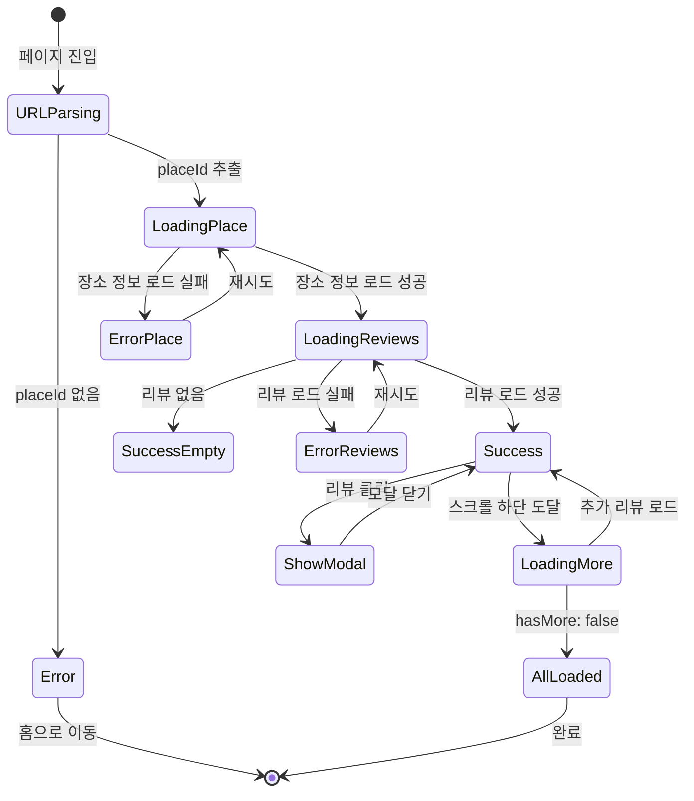
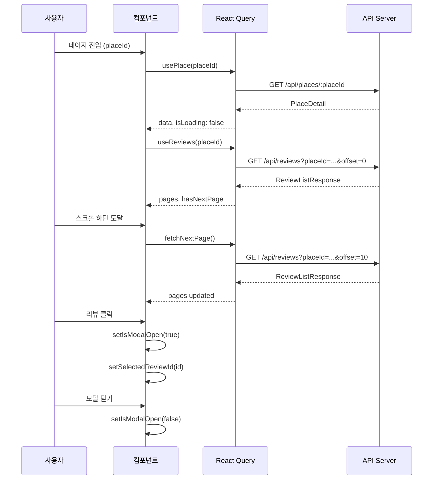

# 장소 상세 페이지 상태관리 설계

> **문서 버전**: 1.0.0
> **작성일**: 2025년 10월 21일
> **페이지**: 장소 상세 페이지 (`/place/detail`)
> **상태관리 라이브러리**: @tanstack/react-query, Zustand (필요시)

---

## 목차

1. [개요](#1-개요)
2. [상태 분류](#2-상태-분류)
3. [React Query 설계](#3-react-query-설계)
4. [상태 전환 다이어그램](#4-상태-전환-다이어그램)
5. [무한 스크롤 구현](#5-무한-스크롤-구현)
6. [로딩/에러/성공 처리](#6-로딩에러성공-처리)
7. [캐싱 전략](#7-캐싱-전략)
8. [컴포넌트 구조](#8-컴포넌트-구조)
9. [타입 정의](#9-타입-정의)
10. [구현 예시](#10-구현-예시)

---

## 1. 개요

### 1.1 페이지 목적

장소 상세 페이지는 다음 정보를 제공합니다:
- 선택한 장소의 기본 정보 (이름, 주소, 카테고리)
- 리뷰 통계 (평균 평점, 총 리뷰 개수)
- 리뷰 목록 (최신순, 무한 스크롤)

### 1.2 상태관리 전략

- **서버 상태**: React Query로 관리
  - 장소 정보 조회
  - 리뷰 통계 조회
  - 리뷰 목록 조회 (무한 스크롤)
- **클라이언트 상태**: 로컬 useState로 관리
  - 리뷰 상세 모달 열림/닫힘
  - 선택된 리뷰 ID
- **전역 상태**: 불필요 (모든 상태는 페이지 로컬)

### 1.3 핵심 원칙

1. **서버 상태는 React Query가 소유**
   - 장소 정보와 리뷰 데이터는 서버의 단일 소스
   - 캐싱과 동기화는 React Query가 자동 처리
2. **UI 상태는 컴포넌트가 소유**
   - 모달, 선택 등 UI 관련 상태는 로컬 useState
3. **최소한의 상태**
   - 파생 가능한 상태는 저장하지 않음
   - 평균 평점 등은 서버에서 계산하여 전달

---

## 2. 상태 분류

### 2.1 서버 상태 (React Query)

| 상태 이름 | 타입 | 설명 | 변경 조건 |
|---------|-----|------|---------|
| **placeData** | `PlaceDetail` | 장소 정보 + 리뷰 통계 | API 응답 수신 시 |
| **reviewsData** | `InfiniteData<ReviewListResponse>` | 리뷰 목록 (페이지별) | 초기 로드 및 추가 로드 시 |

#### 2.1.1 placeData 상세

```typescript
interface PlaceDetail {
  placeId: string;
  name: string;
  address: string;
  category: string;
  latitude: number;
  longitude: number;
  reviewCount: number;      // 총 리뷰 개수
  averageRating: number;    // 평균 평점 (0.0 ~ 5.0)
}
```

**변경 조건**:
- 페이지 최초 마운트 시 API 호출
- `placeId` 변경 시 재조회
- 새 리뷰 작성 후 invalidate 시 재조회

**화면 변화**:
- 로딩 → 장소 정보 카드 표시
- 평균 평점, 리뷰 개수 업데이트

#### 2.1.2 reviewsData 상세

```typescript
interface ReviewListResponse {
  reviews: Review[];        // 현재 페이지 리뷰 목록
  total: number;           // 총 리뷰 개수
  limit: number;           // 페이지당 개수
  offset: number;          // 현재 오프셋
  hasMore: boolean;        // 추가 로드 가능 여부
}
```

**변경 조건**:
- 페이지 최초 마운트 시 첫 페이지 로드
- 무한 스크롤 트리거 시 다음 페이지 로드
- 새 리뷰 작성 후 invalidate 시 전체 재조회

**화면 변화**:
- 로딩 → 리뷰 목록 표시
- 스크롤 하단 도달 → 로딩 스피너 → 추가 리뷰 append
- `hasMore: false` → "모든 리뷰를 확인했습니다" 메시지

### 2.2 UI 상태 (로컬 useState)

| 상태 이름 | 타입 | 기본값 | 설명 | 변경 조건 |
|---------|-----|-------|------|---------|
| **isModalOpen** | `boolean` | `false` | 리뷰 상세 모달 열림 여부 | 리뷰 클릭, 모달 닫기 |
| **selectedReviewId** | `string \| null` | `null` | 선택된 리뷰 ID | 리뷰 클릭 시 설정 |

**화면 변화**:
- `isModalOpen: true` → 리뷰 상세 모달 표시
- `selectedReviewId` 설정 → 해당 리뷰 전체 내용 표시

### 2.3 파생 상태 (계산된 값)

다음 값들은 상태로 저장하지 않고 **계산**합니다:

| 파생 상태 | 계산 방법 | 사용처 |
|---------|---------|-------|
| **selectedReview** | `reviewsData`에서 `selectedReviewId`로 찾기 | 모달 내용 표시 |
| **isEmpty** | `placeData.reviewCount === 0` | 빈 상태 UI 표시 여부 |
| **isLoadingMore** | `isFetchingNextPage` | 무한 스크롤 로딩 표시 |

### 2.4 화면 데이터이지만 상태가 아닌 것

| 데이터 | 이유 |
|-------|-----|
| **장소명, 주소** | `placeData`에서 직접 참조 |
| **평균 평점, 리뷰 개수** | `placeData`에서 직접 참조 |
| **리뷰 본문 미리보기** | 렌더링 시 `truncateText()` 호출 |
| **포맷된 작성일** | 렌더링 시 `formatDate()` 호출 |

---

## 3. React Query 설계

### 3.1 usePlace Hook (장소 정보)

**파일 경로**: `src/features/place-detail/hooks/use-place.ts`

```typescript
import { useQuery } from '@tanstack/react-query';
import { apiClient } from '@/lib/remote/api-client';
import type { PlaceDetail } from '@/types/place';

interface UsePlaceOptions {
  placeId: string;
  enabled?: boolean;
}

export function usePlace({ placeId, enabled = true }: UsePlaceOptions) {
  return useQuery({
    queryKey: ['place', placeId],
    queryFn: async () => {
      const response = await apiClient.get<{ data: PlaceDetail }>(
        `/api/places/${placeId}`
      );
      return response.data;
    },
    enabled: enabled && !!placeId,
    staleTime: 5 * 60 * 1000,      // 5분간 fresh
    gcTime: 10 * 60 * 1000,         // 10분간 캐시 유지
    retry: 2,                        // 실패 시 2회 재시도
  });
}
```

**Query Key**: `['place', placeId]`

**캐싱 전략**:
- `staleTime: 5분` - 장소 정보는 자주 변하지 않으므로 5분간 fresh
- `gcTime: 10분` - 10분간 메모리에 캐시 유지
- `retry: 2` - 네트워크 오류 시 2회 재시도

**에러 처리**:
- `isError: true` → 에러 UI 표시
- `error.message` → 사용자 친화적 메시지로 변환

### 3.2 useReviews Hook (리뷰 목록 - 무한 스크롤)

**파일 경로**: `src/features/place-detail/hooks/use-reviews.ts`

```typescript
import { useInfiniteQuery } from '@tanstack/react-query';
import { apiClient } from '@/lib/remote/api-client';
import type { ReviewListResponse } from '@/types/review';

interface UseReviewsOptions {
  placeId: string;
  enabled?: boolean;
  limit?: number;
}

export function useReviews({
  placeId,
  enabled = true,
  limit = 10,
}: UseReviewsOptions) {
  return useInfiniteQuery({
    queryKey: ['reviews', placeId],
    queryFn: async ({ pageParam = 0 }) => {
      const response = await apiClient.get<{ data: ReviewListResponse }>(
        `/api/reviews`,
        {
          params: {
            placeId,
            limit,
            offset: pageParam,
          },
        }
      );
      return response.data;
    },
    initialPageParam: 0,
    getNextPageParam: (lastPage, allPages) => {
      if (!lastPage.hasMore) return undefined;
      return allPages.length * limit;
    },
    enabled: enabled && !!placeId,
    staleTime: 60 * 1000,           // 1분간 fresh
    gcTime: 5 * 60 * 1000,          // 5분간 캐시 유지
    retry: 2,
  });
}
```

**Query Key**: `['reviews', placeId]`

**무한 스크롤 구현**:
- `initialPageParam: 0` - 첫 페이지 오프셋은 0
- `getNextPageParam` - 다음 페이지 오프셋 계산
- `hasMore: false` 시 `undefined` 반환 → 추가 로드 중단

**캐싱 전략**:
- `staleTime: 1분` - 리뷰는 자주 갱신될 수 있으므로 짧게 설정
- `gcTime: 5분` - 5분간 캐시 유지

### 3.3 useInvalidatePlaceData Hook (캐시 무효화)

**파일 경로**: `src/features/place-detail/hooks/use-invalidate-place-data.ts`

```typescript
import { useQueryClient } from '@tanstack/react-query';

export function useInvalidatePlaceData() {
  const queryClient = useQueryClient();

  const invalidatePlace = (placeId: string) => {
    queryClient.invalidateQueries({ queryKey: ['place', placeId] });
  };

  const invalidateReviews = (placeId: string) => {
    queryClient.invalidateQueries({ queryKey: ['reviews', placeId] });
  };

  const invalidateAll = (placeId: string) => {
    invalidatePlace(placeId);
    invalidateReviews(placeId);
  };

  return {
    invalidatePlace,
    invalidateReviews,
    invalidateAll,
  };
}
```

**사용 시나리오**:
- 리뷰 작성 완료 후 장소 상세 페이지 복귀 시
- `invalidateAll(placeId)` 호출하여 최신 데이터 갱신

---

## 4. 상태 전환 다이어그램

### 4.1 전체 페이지 로딩 플로우



### 4.2 상태별 UI 표시

| 상태 | 조건 | UI 표시 |
|-----|-----|---------|
| **URLParsing** | `placeId` 파싱 중 | 아무것도 표시 안 함 |
| **LoadingPlace** | `isLoading && !data` | 전체 화면 로딩 스피너 |
| **ErrorPlace** | `isError` (장소) | 에러 메시지 + 재시도 버튼 |
| **LoadingReviews** | 장소 로드 완료, 리뷰 로딩 중 | 장소 정보 표시 + 리뷰 영역 스피너 |
| **Success** | `data && reviews.length > 0` | 장소 정보 + 리뷰 목록 |
| **SuccessEmpty** | `data && reviewCount === 0` | 장소 정보 + 빈 상태 UI |
| **LoadingMore** | `isFetchingNextPage` | 리스트 하단 로딩 스피너 |
| **AllLoaded** | `!hasNextPage` | "모든 리뷰를 확인했습니다" |
| **ShowModal** | `isModalOpen: true` | 리뷰 상세 모달 오버레이 |

### 4.3 액션별 상태 변경



---

## 5. 무한 스크롤 구현

### 5.1 스크롤 감지 전략

**방법**: Intersection Observer API 사용

**파일 경로**: `src/hooks/use-intersection-observer.ts`

```typescript
import { useEffect, useRef } from 'react';

interface UseIntersectionObserverOptions {
  onIntersect: () => void;
  enabled?: boolean;
  threshold?: number;
  rootMargin?: string;
}

export function useIntersectionObserver({
  onIntersect,
  enabled = true,
  threshold = 0.1,
  rootMargin = '100px',
}: UseIntersectionObserverOptions) {
  const targetRef = useRef<HTMLDivElement>(null);

  useEffect(() => {
    if (!enabled) return;

    const target = targetRef.current;
    if (!target) return;

    const observer = new IntersectionObserver(
      (entries) => {
        if (entries[0].isIntersecting) {
          onIntersect();
        }
      },
      { threshold, rootMargin }
    );

    observer.observe(target);

    return () => {
      observer.disconnect();
    };
  }, [enabled, onIntersect, threshold, rootMargin]);

  return targetRef;
}
```

### 5.2 무한 스크롤 컴포넌트에서 사용

```typescript
function ReviewList({ placeId }: { placeId: string }) {
  const {
    data,
    fetchNextPage,
    hasNextPage,
    isFetchingNextPage,
  } = useReviews({ placeId });

  const loadMoreRef = useIntersectionObserver({
    onIntersect: () => {
      if (hasNextPage && !isFetchingNextPage) {
        fetchNextPage();
      }
    },
    enabled: hasNextPage,
  });

  const allReviews = data?.pages.flatMap(page => page.reviews) ?? [];

  return (
    <div>
      {allReviews.map(review => (
        <ReviewItem key={review.id} review={review} />
      ))}

      {/* 무한 스크롤 트리거 */}
      <div ref={loadMoreRef} className="h-20">
        {isFetchingNextPage && <LoadingSpinner />}
        {!hasNextPage && allReviews.length > 0 && (
          <p className="text-center text-muted-foreground">
            모든 리뷰를 확인했습니다
          </p>
        )}
      </div>
    </div>
  );
}
```

### 5.3 무한 스크롤 동작 순서

1. 사용자가 리스트를 스크롤
2. `loadMoreRef` 요소가 뷰포트에 진입
3. Intersection Observer 콜백 실행
4. `hasNextPage: true` && `!isFetchingNextPage` 확인
5. `fetchNextPage()` 호출
6. React Query가 다음 페이지 API 호출
7. 응답 수신 후 `pages` 배열에 append
8. 컴포넌트 리렌더링으로 새 리뷰 표시

---

## 6. 로딩/에러/성공 처리

### 6.1 로딩 상태 처리

#### 6.1.1 초기 로딩 (장소 정보)

```typescript
if (placeQuery.isLoading) {
  return (
    <div className="flex items-center justify-center min-h-screen">
      <LoadingSpinner size={48} text="장소 정보를 불러오는 중..." />
    </div>
  );
}
```

#### 6.1.2 리뷰 초기 로딩

```typescript
if (reviewsQuery.isLoading) {
  return (
    <div className="flex items-center justify-center py-8">
      <LoadingSpinner size={32} text="리뷰를 불러오는 중..." />
    </div>
  );
}
```

#### 6.1.3 추가 로딩 (무한 스크롤)

```typescript
{isFetchingNextPage && (
  <div className="flex justify-center py-4">
    <LoadingSpinner size={24} />
  </div>
)}
```

### 6.2 에러 상태 처리

#### 6.2.1 장소 정보 로드 실패

```typescript
if (placeQuery.isError) {
  return (
    <div className="flex flex-col items-center justify-center min-h-screen p-4">
      <AlertCircle size={48} className="text-destructive mb-4" />
      <h2 className="text-lg font-semibold mb-2">
        장소 정보를 불러올 수 없습니다
      </h2>
      <p className="text-sm text-muted-foreground mb-4">
        {placeQuery.error.message || '다시 시도해주세요'}
      </p>
      <Button onClick={() => placeQuery.refetch()}>
        재시도
      </Button>
    </div>
  );
}
```

#### 6.2.2 리뷰 로드 실패

```typescript
if (reviewsQuery.isError) {
  return (
    <div className="p-4">
      <EmptyState
        icon={AlertCircle}
        title="리뷰를 불러올 수 없습니다"
        description={reviewsQuery.error.message}
        action={
          <Button onClick={() => reviewsQuery.refetch()}>
            재시도
          </Button>
        }
      />
    </div>
  );
}
```

### 6.3 성공 상태 처리

#### 6.3.1 리뷰 있음

```typescript
if (allReviews.length > 0) {
  return (
    <div className="space-y-4">
      {allReviews.map(review => (
        <ReviewItem
          key={review.id}
          review={review}
          onClick={() => handleReviewClick(review.id)}
        />
      ))}
    </div>
  );
}
```

#### 6.3.2 리뷰 없음 (빈 상태)

```typescript
if (placeData.reviewCount === 0) {
  return (
    <EmptyState
      icon={MessageSquare}
      title="아직 작성된 리뷰가 없습니다"
      description="첫 번째 리뷰를 작성해보세요!"
      action={
        <Button onClick={handleWriteReview}>
          첫 리뷰 작성하기
        </Button>
      }
    />
  );
}
```

---

## 7. 캐싱 전략

### 7.1 Query Key 설계

```typescript
// 장소 정보
['place', placeId]

// 리뷰 목록
['reviews', placeId]

// 예시:
['place', '12345']
['reviews', '12345']
```

**장점**:
- `placeId`별로 독립적인 캐시
- 여러 장소를 빠르게 전환해도 캐시 히트
- 특정 장소만 선택적으로 invalidate 가능

### 7.2 Stale Time 전략

| 데이터 | Stale Time | 이유 |
|-------|-----------|-----|
| **장소 정보** | 5분 | 장소 정보는 자주 변하지 않음 |
| **리뷰 목록** | 1분 | 리뷰는 실시간 업데이트될 수 있음 |

**Stale vs Fresh**:
- **Fresh**: 캐시 데이터를 그대로 사용, 백그라운드 갱신 안 함
- **Stale**: 캐시 데이터를 보여주되, 백그라운드에서 갱신

### 7.3 Cache Time (GC Time) 전략

| 데이터 | GC Time | 이유 |
|-------|---------|-----|
| **장소 정보** | 10분 | 사용자가 여러 장소를 탐색할 수 있음 |
| **리뷰 목록** | 5분 | 메모리 사용량 제어 |

**GC Time 의미**:
- 마지막 observer가 unmount된 후 캐시를 메모리에 유지하는 시간
- GC Time 후 자동으로 캐시 삭제

### 7.4 Invalidation 시나리오

#### 시나리오 1: 리뷰 작성 완료 후

```typescript
// 리뷰 작성 페이지에서 완료 후 홈으로 이동
// → 사용자가 다시 장소 상세 페이지 방문 시
const { invalidateAll } = useInvalidatePlaceData();

// 페이지 마운트 시 URL에 `refresh=true` 있으면 invalidate
useEffect(() => {
  const searchParams = new URLSearchParams(window.location.search);
  if (searchParams.get('refresh') === 'true' && placeId) {
    invalidateAll(placeId);
  }
}, [placeId, invalidateAll]);
```

#### 시나리오 2: 수동 새로고침

```typescript
// Pull-to-Refresh 또는 새로고침 버튼
const handleRefresh = async () => {
  await Promise.all([
    placeQuery.refetch(),
    reviewsQuery.refetch(),
  ]);
};
```

### 7.5 Optimistic Update (향후)

리뷰 삭제 기능 추가 시:

```typescript
const deleteReviewMutation = useMutation({
  mutationFn: deleteReview,
  onMutate: async (reviewId) => {
    // 낙관적 업데이트: 즉시 UI에서 제거
    await queryClient.cancelQueries({ queryKey: ['reviews', placeId] });

    const previousReviews = queryClient.getQueryData(['reviews', placeId]);

    queryClient.setQueryData(['reviews', placeId], (old) => {
      // 삭제된 리뷰 제외하고 새 데이터 반환
    });

    return { previousReviews };
  },
  onError: (err, reviewId, context) => {
    // 실패 시 이전 데이터로 롤백
    queryClient.setQueryData(['reviews', placeId], context.previousReviews);
  },
  onSettled: () => {
    queryClient.invalidateQueries({ queryKey: ['reviews', placeId] });
  },
});
```

---

## 8. 컴포넌트 구조

### 8.1 컴포넌트 트리

```
PlaceDetailPage
├── PlaceInfoCard (장소 정보)
├── ReviewStats (통계)
│   ├── RatingStars (평균 평점)
│   └── ReviewCount (리뷰 개수)
├── WriteReviewButton (리뷰 작성 버튼)
└── ReviewList (리뷰 목록)
    ├── ReviewItem (리뷰 아이템) × N
    ├── LoadingSpinner (무한 스크롤 로딩)
    └── AllLoadedMessage (완료 메시지)

ReviewDetailModal (별도 오버레이)
└── ReviewContent (리뷰 전체 내용)
```

### 8.2 상태 소유자

| 컴포넌트 | 소유 상태 | 노출 함수/값 |
|---------|---------|------------|
| **PlaceDetailPage** | `isModalOpen`, `selectedReviewId` | `handleReviewClick`, `handleCloseModal` |
| **ReviewList** | - (React Query 사용) | - |
| **ReviewItem** | - | `onClick` prop 받음 |

### 8.3 Props Drilling 최소화

**문제**: `handleReviewClick`을 `ReviewList` → `ReviewItem`으로 전달

**해결책 1**: Props로 전달 (현재 깊이가 얕으므로 OK)

```typescript
<ReviewList onReviewClick={handleReviewClick} />
```

**해결책 2**: Context 사용 (향후 깊이가 깊어지면)

```typescript
const PlaceDetailContext = createContext<{
  onReviewClick: (id: string) => void;
}>(null);

// PlaceDetailPage에서 제공
<PlaceDetailContext.Provider value={{ onReviewClick: handleReviewClick }}>
  <ReviewList />
</PlaceDetailContext.Provider>

// ReviewItem에서 사용
const { onReviewClick } = useContext(PlaceDetailContext);
```

**권장**: 현재는 Props 전달로 충분

---

## 9. 타입 정의

### 9.1 공통 타입 (재사용)

**파일**: `src/types/place.ts`, `src/types/review.ts` (이미 정의됨)

```typescript
// src/types/place.ts
export interface PlaceDetail {
  placeId: string;
  name: string;
  address: string;
  category: string;
  latitude: number;
  longitude: number;
  reviewCount: number;
  averageRating: number;
}

// src/types/review.ts
export interface Review {
  id: string;
  placeId: string;
  authorName: string;
  rating: number;
  content: string;
  createdAt: string;
}

export interface ReviewListResponse {
  reviews: Review[];
  total: number;
  limit: number;
  offset: number;
  hasMore: boolean;
}
```

### 9.2 페이지 전용 타입

**파일**: `src/features/place-detail/types.ts`

```typescript
/**
 * 리뷰 상세 모달 상태
 */
export interface ReviewModalState {
  isOpen: boolean;
  reviewId: string | null;
}

/**
 * 페이지 파라미터
 */
export interface PlaceDetailPageParams {
  placeId: string;
}

/**
 * 페이지 검색 파라미터
 */
export interface PlaceDetailSearchParams {
  refresh?: 'true' | 'false';
}
```

---

## 10. 구현 예시

### 10.1 PlaceDetailPage 컴포넌트

**파일**: `src/app/place/detail/page.tsx`

```typescript
'use client';

import { useState } from 'react';
import { useSearchParams } from 'next/navigation';
import { usePlace } from '@/features/place-detail/hooks/use-place';
import { useReviews } from '@/features/place-detail/hooks/use-reviews';
import { useInvalidatePlaceData } from '@/features/place-detail/hooks/use-invalidate-place-data';
import { PlaceInfoCard } from '@/features/place-detail/components/place-info-card';
import { ReviewStats } from '@/features/place-detail/components/review-stats';
import { WriteReviewButton } from '@/features/place-detail/components/write-review-button';
import { ReviewList } from '@/features/place-detail/components/review-list';
import { ReviewDetailModal } from '@/features/place-detail/components/review-detail-modal';
import { LoadingSpinner } from '@/components/common/loading-spinner';
import { EmptyState } from '@/components/common/empty-state';
import { AlertCircle, ArrowLeft } from 'lucide-react';
import { Button } from '@/components/ui/button';

interface PlaceDetailPageProps {
  searchParams: Promise<{ placeId?: string; refresh?: string }>;
}

export default async function PlaceDetailPage({
  searchParams,
}: PlaceDetailPageProps) {
  const params = await searchParams;
  const placeId = params.placeId;

  if (!placeId) {
    return (
      <EmptyState
        icon={AlertCircle}
        title="잘못된 접근입니다"
        description="장소 정보를 찾을 수 없습니다"
        action={
          <Button onClick={() => window.location.href = '/'}>
            홈으로 이동
          </Button>
        }
      />
    );
  }

  return <PlaceDetailPageContent placeId={placeId} refresh={params.refresh} />;
}

function PlaceDetailPageContent({
  placeId,
  refresh,
}: {
  placeId: string;
  refresh?: string;
}) {
  const [isModalOpen, setIsModalOpen] = useState(false);
  const [selectedReviewId, setSelectedReviewId] = useState<string | null>(null);

  const placeQuery = usePlace({ placeId });
  const reviewsQuery = useReviews({ placeId });
  const { invalidateAll } = useInvalidatePlaceData();

  // 리프레시 파라미터가 있으면 캐시 무효화
  useEffect(() => {
    if (refresh === 'true') {
      invalidateAll(placeId);
    }
  }, [refresh, placeId, invalidateAll]);

  // 리뷰 클릭 핸들러
  const handleReviewClick = (reviewId: string) => {
    setSelectedReviewId(reviewId);
    setIsModalOpen(true);
  };

  // 모달 닫기 핸들러
  const handleCloseModal = () => {
    setIsModalOpen(false);
    setSelectedReviewId(null);
  };

  // 장소 정보 로딩
  if (placeQuery.isLoading) {
    return (
      <div className="flex items-center justify-center min-h-screen">
        <LoadingSpinner size={48} text="장소 정보를 불러오는 중..." />
      </div>
    );
  }

  // 장소 정보 에러
  if (placeQuery.isError) {
    return (
      <div className="flex flex-col items-center justify-center min-h-screen p-4">
        <AlertCircle size={48} className="text-destructive mb-4" />
        <h2 className="text-lg font-semibold mb-2">
          장소 정보를 불러올 수 없습니다
        </h2>
        <p className="text-sm text-muted-foreground mb-4">
          {placeQuery.error.message || '다시 시도해주세요'}
        </p>
        <Button onClick={() => placeQuery.refetch()}>재시도</Button>
      </div>
    );
  }

  const placeData = placeQuery.data;
  const allReviews =
    reviewsQuery.data?.pages.flatMap((page) => page.reviews) ?? [];

  // 선택된 리뷰 찾기
  const selectedReview = selectedReviewId
    ? allReviews.find((r) => r.id === selectedReviewId)
    : null;

  return (
    <div className="max-w-screen-sm mx-auto min-h-screen bg-background">
      {/* 헤더 */}
      <header className="sticky top-0 z-10 bg-background border-b">
        <div className="flex items-center gap-2 p-4">
          <Button
            variant="ghost"
            size="icon"
            onClick={() => window.history.back()}
          >
            <ArrowLeft size={20} />
          </Button>
          <h1 className="text-lg font-semibold">장소 상세</h1>
        </div>
      </header>

      {/* 장소 정보 */}
      <div className="p-4">
        <PlaceInfoCard place={placeData} />
      </div>

      {/* 리뷰 통계 */}
      <div className="px-4 py-2 border-y bg-muted/30">
        <ReviewStats
          averageRating={placeData.averageRating}
          reviewCount={placeData.reviewCount}
        />
      </div>

      {/* 리뷰 작성 버튼 */}
      <div className="p-4 border-b">
        <WriteReviewButton placeId={placeId} place={placeData} />
      </div>

      {/* 리뷰 목록 */}
      <div className="p-4">
        <ReviewList
          placeId={placeId}
          onReviewClick={handleReviewClick}
        />
      </div>

      {/* 리뷰 상세 모달 */}
      {selectedReview && (
        <ReviewDetailModal
          review={selectedReview}
          isOpen={isModalOpen}
          onClose={handleCloseModal}
        />
      )}
    </div>
  );
}
```

### 10.2 ReviewList 컴포넌트 (무한 스크롤)

**파일**: `src/features/place-detail/components/review-list.tsx`

```typescript
'use client';

import { useReviews } from '@/features/place-detail/hooks/use-reviews';
import { useIntersectionObserver } from '@/hooks/use-intersection-observer';
import { ReviewItem } from './review-item';
import { LoadingSpinner } from '@/components/common/loading-spinner';
import { EmptyState } from '@/components/common/empty-state';
import { MessageSquare, AlertCircle } from 'lucide-react';
import { Button } from '@/components/ui/button';

interface ReviewListProps {
  placeId: string;
  onReviewClick: (reviewId: string) => void;
}

export function ReviewList({ placeId, onReviewClick }: ReviewListProps) {
  const {
    data,
    isLoading,
    isError,
    error,
    fetchNextPage,
    hasNextPage,
    isFetchingNextPage,
    refetch,
  } = useReviews({ placeId });

  // 무한 스크롤 트리거
  const loadMoreRef = useIntersectionObserver({
    onIntersect: () => {
      if (hasNextPage && !isFetchingNextPage) {
        fetchNextPage();
      }
    },
    enabled: !!hasNextPage,
  });

  // 로딩 상태
  if (isLoading) {
    return (
      <div className="flex justify-center py-8">
        <LoadingSpinner size={32} text="리뷰를 불러오는 중..." />
      </div>
    );
  }

  // 에러 상태
  if (isError) {
    return (
      <EmptyState
        icon={AlertCircle}
        title="리뷰를 불러올 수 없습니다"
        description={error.message}
        action={<Button onClick={() => refetch()}>재시도</Button>}
      />
    );
  }

  const allReviews = data?.pages.flatMap((page) => page.reviews) ?? [];

  // 빈 상태
  if (allReviews.length === 0) {
    return (
      <EmptyState
        icon={MessageSquare}
        title="아직 작성된 리뷰가 없습니다"
        description="첫 번째 리뷰를 작성해보세요!"
      />
    );
  }

  return (
    <div className="space-y-4">
      {/* 리뷰 목록 */}
      {allReviews.map((review) => (
        <ReviewItem
          key={review.id}
          review={review}
          onClick={() => onReviewClick(review.id)}
        />
      ))}

      {/* 무한 스크롤 트리거 */}
      <div ref={loadMoreRef} className="h-20 flex items-center justify-center">
        {isFetchingNextPage && <LoadingSpinner size={24} />}
        {!hasNextPage && allReviews.length > 0 && (
          <p className="text-sm text-muted-foreground">
            모든 리뷰를 확인했습니다
          </p>
        )}
      </div>
    </div>
  );
}
```

### 10.3 ReviewItem 컴포넌트

**파일**: `src/features/place-detail/components/review-item.tsx`

```typescript
'use client';

import type { Review } from '@/types/review';
import { RatingStars } from '@/components/common/rating-stars';
import { truncateReviewContent } from '@/lib/format/text';
import { formatDate } from '@/lib/format/date';
import { Card } from '@/components/ui/card';

interface ReviewItemProps {
  review: Review;
  onClick: () => void;
}

export function ReviewItem({ review, onClick }: ReviewItemProps) {
  return (
    <Card
      className="p-4 cursor-pointer hover:bg-muted/50 transition-colors"
      onClick={onClick}
    >
      <div className="flex items-start justify-between mb-2">
        <div>
          <p className="font-medium text-sm">{review.authorName}</p>
          <p className="text-xs text-muted-foreground">
            {formatDate(review.createdAt)}
          </p>
        </div>
        <RatingStars rating={review.rating} showNumber={false} size={14} />
      </div>
      <p className="text-sm text-foreground">
        {truncateReviewContent(review.content)}
      </p>
    </Card>
  );
}
```

---

## 11. 정리 및 체크리스트

### 11.1 구현 체크리스트

- [ ] `usePlace` Hook 구현
- [ ] `useReviews` Hook 구현 (무한 스크롤)
- [ ] `useInvalidatePlaceData` Hook 구현
- [ ] `useIntersectionObserver` Hook 구현
- [ ] `PlaceDetailPage` 컴포넌트 구현
- [ ] `PlaceInfoCard` 컴포넌트 구현
- [ ] `ReviewStats` 컴포넌트 구현
- [ ] `ReviewList` 컴포넌트 구현
- [ ] `ReviewItem` 컴포넌트 구현
- [ ] `ReviewDetailModal` 컴포넌트 구현
- [ ] 로딩/에러/빈 상태 UI 구현
- [ ] 무한 스크롤 테스트
- [ ] 리프레시 로직 테스트

### 11.2 핵심 포인트 요약

1. **서버 상태는 React Query**
   - `usePlace`: 장소 정보 조회
   - `useReviews`: 리뷰 무한 스크롤
2. **UI 상태는 로컬 useState**
   - 모달 열림/닫힘
   - 선택된 리뷰 ID
3. **무한 스크롤**
   - Intersection Observer로 구현
   - `useInfiniteQuery` 사용
4. **캐싱**
   - 장소 정보: 5분 fresh, 10분 캐시
   - 리뷰: 1분 fresh, 5분 캐시
5. **에러 처리**
   - 각 상태별 에러 UI 제공
   - 재시도 버튼 제공

---

**End of Document**
