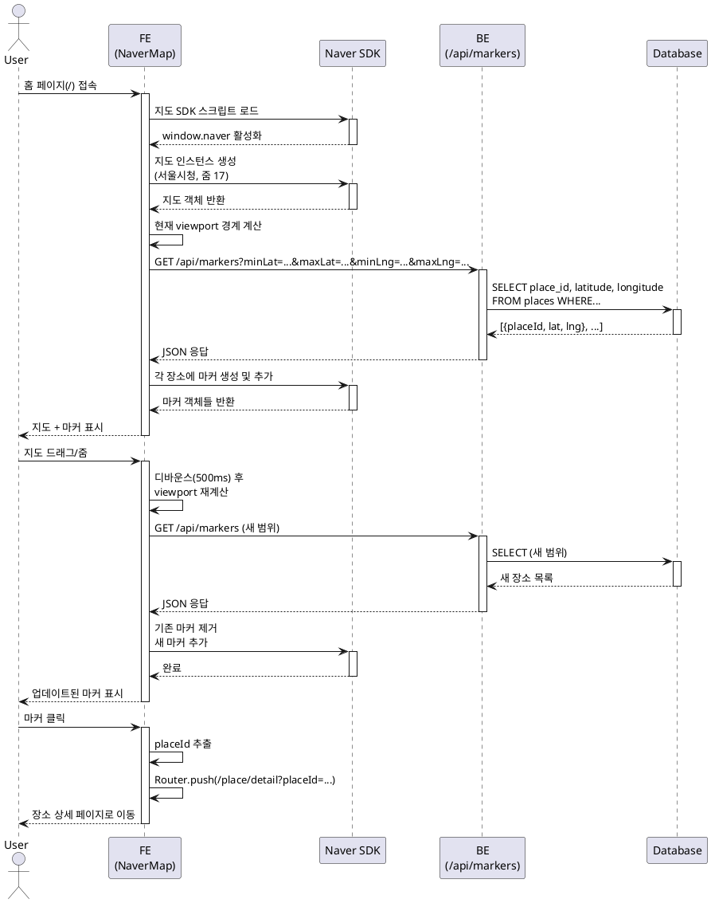

# 유스케이스 UC-001: 지도 표시 및 마커 관리

## 1. 개요

### 1.1 목적
사용자가 홈 페이지에서 네이버 지도를 통해 리뷰가 있는 맛집 위치를 시각적으로 확인하고, 지도 조작을 통해 원하는 지역의 맛집을 탐색할 수 있도록 한다.

### 1.2 범위
- 네이버 지도 SDK 로딩 및 초기화
- 지도 기본 표시 (초기 위치: 서울시청)
- 지도 인터랙션 (드래그, 줌)
- 현재 viewport 내 리뷰 있는 장소 마커 표시
- 마커 클릭 시 장소 상세 페이지 이동

### 1.3 액터
- **주요 액터**: 비회원 사용자
- **부 액터**: 네이버 지도 SDK, 백엔드 API, Database

---

## 2. 선행 조건

- 사용자가 웹사이트 홈 페이지(`/`)에 접속한다.
- 브라우저가 JavaScript를 지원한다.
- 네이버 클라우드 플랫폼에서 발급받은 Client ID가 환경 변수에 설정되어 있다.
- 데이터베이스에 최소 1개 이상의 리뷰 데이터가 존재한다.

---

## 3. 참여 컴포넌트

- **프론트엔드 (NaverMap 컴포넌트)**: 지도 렌더링, 마커 표시, 사용자 인터랙션 처리
- **네이버 지도 SDK**: 지도 객체 생성, 마커 생성 및 관리
- **백엔드 API (`/api/markers`)**: viewport 범위 내 장소 좌표 조회
- **Database (places, reviews 테이블)**: 리뷰가 있는 장소 정보 저장

---

## 4. 기본 플로우 (Basic Flow)

### 4.1 단계별 흐름

#### Step 1: 페이지 접속 및 지도 SDK 로드
- **사용자**: 홈 페이지(`/`) URL 접속
- **FE**: Next.js 페이지 컴포넌트 렌더링 시작
- **FE**: `next/script`를 통해 네이버 지도 SDK 스크립트 로드
  - URL: `https://openapi.map.naver.com/openapi/v3/maps.js?ncpClientId={CLIENT_ID}`
  - 전략: `afterInteractive` (페이지 인터랙티브 후 로드)
- **네이버 SDK**: 스크립트 로드 완료, `window.naver` 객체 활성화
- **출력**: 로딩 스피너 표시

#### Step 2: 지도 초기화
- **FE**: `window.naver` 객체 활성화 감지
- **FE**: 네이버 지도 인스턴스 생성
  - 중심 좌표: 서울시청 (37.5665, 126.9780)
  - 줌 레벨: 17
  - 줌 컨트롤: 우측 상단 표시
- **출력**: 네이버 지도 화면에 표시

#### Step 3: 현재 viewport 마커 조회
- **FE**: 현재 지도 영역(viewport) 경계 좌표 계산
  - `minLat`, `maxLat`, `minLng`, `maxLng`
- **FE → BE**: `GET /api/markers?minLat={}&maxLat={}&minLng={}&maxLng={}`
- **BE → DB**: SQL 쿼리 실행
  ```sql
  SELECT DISTINCT p.place_id, p.latitude, p.longitude
  FROM places p
  WHERE p.latitude BETWEEN :minLat AND :maxLat
    AND p.longitude BETWEEN :minLng AND :maxLng
    AND EXISTS (SELECT 1 FROM reviews r WHERE r.place_id = p.place_id)
  LIMIT 100
  ```
- **BE → FE**: JSON 응답 반환
  ```json
  [
    { "placeId": "12345", "latitude": 37.5665, "longitude": 126.9780 },
    ...
  ]
  ```

#### Step 4: 마커 렌더링
- **FE**: 응답 받은 각 장소 좌표에 마커 생성
- **네이버 SDK**: `naver.maps.Marker` 객체 생성 및 지도에 추가
- **FE**: 각 마커에 클릭 이벤트 리스너 등록
- **출력**: 지도 위에 마커들 표시

#### Step 5: 사용자 지도 조작 (드래그/줌)
- **사용자**: 지도를 드래그하여 이동하거나 핀치 줌으로 확대/축소
- **네이버 SDK**: 지도 이동/줌 이벤트 발생
- **FE**: 이벤트 감지 및 디바운스 처리 (500ms)
- **FE**: Step 3~4 반복 (새로운 viewport 범위로 마커 재조회)
- **출력**: 새로운 영역의 마커들 표시, 영역 밖 마커 제거

#### Step 6: 마커 클릭
- **사용자**: 특정 마커 클릭
- **FE**: 마커 클릭 이벤트 핸들러 실행
- **FE**: 해당 마커의 `placeId` 추출
- **FE**: Next.js Router를 통해 장소 상세 페이지로 네비게이션
  - URL: `/place/detail?placeId={placeId}`
- **출력**: 페이지 전환 (1초 이내)

### 4.2 시퀀스 다이어그램



---

## 5. 대안 플로우 (Alternative Flows)

### 5.1 대안 플로우 1: 마커 50개 초과 (클러스터링)

**시작 조건**: Step 3에서 조회된 장소가 50개 이상

**단계**:
1. FE는 마커 개수가 50개 초과임을 감지
2. 네이버 지도 MarkerClustering 라이브러리 활성화
3. 개별 마커 대신 클러스터 마커 표시 (숫자 포함)
4. 사용자가 클러스터 마커 클릭 시 해당 영역으로 줌 인

**결과**: 성능 저하 없이 많은 마커 표시 가능

### 5.2 대안 플로우 2: viewport 내 리뷰 있는 장소 없음

**시작 조건**: Step 3에서 조회된 장소가 0개

**단계**:
1. BE가 빈 배열 반환 `[]`
2. FE가 마커 없음 감지
3. 기존 마커 모두 제거
4. 지도만 표시 (마커 없음)

**결과**: 사용자는 빈 지도를 보며 다른 지역으로 이동 가능

---

## 6. 예외 플로우 (Exception Flows)

### 6.1 예외 상황 1: 네이버 지도 SDK 로드 실패

**발생 조건**:
- 네트워크 불안정
- Client ID 오류
- 네이버 서버 장애

**처리 방법**:
1. `next/script` onError 핸들러 감지
2. 에러 UI 컴포넌트 표시
3. "지도를 불러올 수 없습니다. 잠시 후 다시 시도해주세요." 메시지 표시
4. [재시도] 버튼 제공
5. 버튼 클릭 시 페이지 새로고침

**에러 코드**: `MAP_SDK_LOAD_FAILED`

**사용자 메시지**: "지도를 불러올 수 없습니다. 잠시 후 다시 시도해주세요."

### 6.2 예외 상황 2: 마커 조회 API 호출 실패

**발생 조건**:
- 네트워크 오류
- 데이터베이스 연결 오류
- API 서버 장애

**처리 방법**:
1. API 호출 try-catch 처리
2. 콘솔에 에러 로깅
3. 기존 마커 유지 (제거하지 않음)
4. Toast 메시지 표시: "마커 정보를 불러올 수 없습니다."
5. 3초 후 자동 재시도 (최대 3회)

**에러 코드**: `HTTP 500` (서버 오류)

**사용자 메시지**: "마커 정보를 불러올 수 없습니다. 잠시 후 다시 시도됩니다."

### 6.3 예외 상황 3: Client ID 환경 변수 누락

**발생 조건**:
- `.env.local` 파일 미생성
- `NEXT_PUBLIC_NAVER_MAP_CLIENT_ID` 미설정

**처리 방법**:
1. 빌드 타임 또는 런타임에 환경 변수 검증
2. 환경 변수 없을 시 에러 페이지 표시
3. "지도 서비스를 사용할 수 없습니다. 관리자에게 문의하세요." 메시지
4. 콘솔에 상세 에러 로깅 (개발자용)

**에러 코드**: `ENV_VAR_MISSING`

**사용자 메시지**: "지도 서비스를 일시적으로 사용할 수 없습니다."

### 6.4 예외 상황 4: 마커 클릭 후 네비게이션 실패

**발생 조건**:
- placeId 값이 유효하지 않음
- Router 오류

**처리 방법**:
1. placeId 유효성 검증 (빈 문자열, null 체크)
2. 검증 실패 시 에러 Toast 표시
3. "잘못된 장소 정보입니다. 다시 시도해주세요."
4. 네비게이션 취소

**에러 코드**: `INVALID_PLACE_ID`

**사용자 메시지**: "잘못된 장소 정보입니다. 다시 시도해주세요."

---

## 7. 후행 조건 (Post-conditions)

### 7.1 성공 시

- **데이터베이스 변경**: 없음 (조회만 수행)
- **시스템 상태**:
  - 지도가 화면에 정상 표시됨
  - 현재 viewport 내 리뷰 있는 장소들에 마커 표시됨
  - 사용자는 지도 드래그/줌 인터랙션 가능
- **외부 시스템**: 네이버 지도 SDK 활성화 상태 유지

### 7.2 실패 시

- **데이터 롤백**: 해당 없음 (읽기 전용 작업)
- **시스템 상태**:
  - SDK 로드 실패: 에러 UI 표시, 지도 미표시
  - API 실패: 기존 마커 유지, 에러 메시지 표시

---

## 8. 비기능 요구사항

### 8.1 성능
- **지도 초기 로딩**: 2초 이내 완료
- **마커 조회 API 응답**: 1초 이내
- **지도 드래그 후 마커 업데이트**: 디바운스 500ms 적용 후 1초 이내
- **마커 개수 제한**: 1회 최대 100개 (DB 쿼리 LIMIT 100)

### 8.2 보안
- **Client ID 노출**: 브라우저에 노출되지만 보안상 문제없음 (공식 문서 기준)
- **API 엔드포인트**: 읽기 전용이며 민감 정보 포함하지 않음

### 8.3 가용성
- **SDK 로드 재시도**: 최대 3회 재시도 (5초 간격)
- **API 재시도**: 자동 재시도 3회 (3초 간격)

---

## 9. UI/UX 요구사항

### 9.1 화면 구성
- **지도 영역**: 화면 전체 (MainLayout 내 최대 360x720)
- **줌 컨트롤**: 우측 상단 고정
- **로딩 스피너**: 지도 로딩 중 중앙 표시
- **에러 UI**: 지도 영역 대신 중앙 정렬 에러 메시지 + 재시도 버튼

### 9.2 사용자 경험
- **지도 인터랙션**: 부드러운 드래그, 핀치 줌 지원
- **마커 클릭**: 터치 타겟 최소 44x44px (Apple HIG 준수)
- **로딩 피드백**:
  - 초기 로딩: 스피너 표시
  - 마커 업데이트: 기존 마커 유지 (깜빡임 최소화)
- **에러 복구**:
  - 명확한 에러 메시지
  - 재시도 버튼 제공
  - 자동 재시도 (비간섭적)

---

## 10. 비즈니스 규칙 (Business Rules)

### BR-001: 리뷰 있는 장소만 마커 표시
- **설명**: 마커는 `reviews` 테이블에 최소 1개 이상의 리뷰가 있는 장소만 표시
- **근거**: 리뷰 없는 장소는 사용자에게 의미 없는 정보
- **구현**: SQL에서 `EXISTS` 서브쿼리로 필터링

### BR-002: 초기 위치는 서울시청
- **설명**: 지도 최초 로딩 시 중심 좌표는 서울시청 (37.5665, 126.9780)
- **근거**: 한국 중심 도시이며, 대부분 사용자가 위치 권한 미허용 시 기본값 필요
- **구현**: 지도 생성 시 center 옵션

### BR-003: 마커 최대 개수 제한
- **설명**: 1회 API 응답에서 최대 100개 장소만 반환
- **근거**:
  - 과도한 마커는 성능 저하 및 UI 혼잡도 증가
  - 사용자가 줌 인하여 세부 지역 탐색 유도
- **구현**: SQL `LIMIT 100`

### BR-004: 디바운스 적용
- **설명**: 지도 드래그/줌 이벤트는 500ms 디바운스 후 마커 재조회
- **근거**:
  - 불필요한 API 호출 방지
  - 부드러운 UX 제공 (매 픽셀마다 API 호출 방지)
- **구현**: lodash `debounce` 또는 custom hook

### BR-005: 마커 클릭 시 즉시 페이지 이동
- **설명**: 마커 클릭 시 InfoWindow 없이 즉시 장소 상세 페이지로 네비게이션
- **근거**:
  - 간편한 UX (추가 클릭 불필요)
  - 모바일 화면에서 InfoWindow는 공간 차지
- **구현**: 마커 클릭 이벤트에서 `router.push()` 직접 호출

---

## 11. API 명세

### 11.1 마커 조회 API

#### Endpoint
```
GET /api/markers
```

#### Query Parameters
| 파라미터 | 타입 | 필수 | 설명 | 예시 |
|---------|------|------|------|------|
| `minLat` | number | ✅ | 최소 위도 | 37.56 |
| `maxLat` | number | ✅ | 최대 위도 | 37.57 |
| `minLng` | number | ✅ | 최소 경도 | 126.97 |
| `maxLng` | number | ✅ | 최대 경도 | 126.98 |

#### Response (Success)
**HTTP 200**
```json
{
  "markers": [
    {
      "placeId": "12345",
      "latitude": 37.5665,
      "longitude": 126.9780
    },
    {
      "placeId": "67890",
      "latitude": 37.5670,
      "longitude": 126.9785
    }
  ],
  "count": 2
}
```

#### Response (Empty)
**HTTP 200**
```json
{
  "markers": [],
  "count": 0
}
```

#### Response (Error)
**HTTP 400** (잘못된 파라미터)
```json
{
  "error": "Invalid query parameters",
  "details": "minLat, maxLat, minLng, maxLng are required"
}
```

**HTTP 500** (서버 오류)
```json
{
  "error": "Failed to fetch markers",
  "message": "Database connection error"
}
```

---

## 12. 데이터베이스 쿼리

### 12.1 마커 조회 쿼리

```sql
SELECT DISTINCT
    p.place_id,
    p.latitude,
    p.longitude
FROM places p
WHERE p.latitude >= :minLat
    AND p.latitude <= :maxLat
    AND p.longitude >= :minLng
    AND p.longitude <= :maxLng
    AND EXISTS (
        SELECT 1 FROM reviews r
        WHERE r.place_id = p.place_id
    )
LIMIT 100;
```

**인덱스 활용**: `idx_places_coords` (latitude, longitude)

**실행 계획**: Index Scan on `idx_places_coords` → Semi Join on `reviews`

---

## 13. 테스트 시나리오

### 13.1 성공 케이스

| 테스트 케이스 ID | 입력값 | 기대 결과 |
|----------------|--------|----------|
| TC-001-01 | 홈 페이지 접속 | 지도 2초 이내 로딩, 서울시청 중심 |
| TC-001-02 | viewport: (37.56~37.57, 126.97~126.98), 리뷰 3개 | 마커 3개 표시 |
| TC-001-03 | 지도 드래그 (새 영역) | 500ms 후 새 마커 표시 |
| TC-001-04 | 마커 클릭 | 1초 이내 장소 상세 페이지 이동 |
| TC-001-05 | 줌 아웃 (50개 초과) | 클러스터링 적용 또는 일부 마커 표시 |

### 13.2 실패 케이스

| 테스트 케이스 ID | 입력값 | 기대 결과 |
|----------------|--------|----------|
| TC-001-06 | 잘못된 Client ID | 에러 메시지 + 재시도 버튼 |
| TC-001-07 | 네트워크 오류 (API) | 기존 마커 유지, Toast 에러 메시지 |
| TC-001-08 | DB 연결 오류 | HTTP 500, 에러 메시지 반환 |
| TC-001-09 | viewport 내 리뷰 0개 | 마커 없이 지도만 표시 |
| TC-001-10 | 잘못된 placeId 마커 클릭 | 에러 Toast, 네비게이션 취소 |

---

## 14. 관련 유스케이스

- **선행 유스케이스**: 없음 (홈 페이지 진입이 시작점)
- **후행 유스케이스**:
  - UC-002: 장소 검색
  - UC-003: 장소 상세 조회 (마커 클릭 후)
- **연관 유스케이스**:
  - UC-004: 리뷰 작성 (검색 결과에서 진입)

---

## 15. 변경 이력

| 버전 | 날짜 | 작성자 | 변경 내용 |
|------|------|--------|-----------|
| 1.0  | 2025-10-21 | Development Team | 초기 작성 |

---

## 부록

### A. 용어 정의

| 용어 | 정의 |
|------|------|
| **viewport** | 현재 화면에 보이는 지도 영역 (경계 좌표로 표현) |
| **마커** | 지도 위에 특정 위치를 표시하는 시각적 요소 |
| **디바운스** | 연속된 이벤트를 지연시켜 마지막 이벤트만 처리하는 기법 |
| **클러스터링** | 가까운 마커들을 하나의 그룹으로 표시하는 기법 |

### B. 참고 자료

- [네이버 지도 Web Dynamic Map SDK 문서](https://navermaps.github.io/maps.js.ncp/)
- [네이버 클라우드 플랫폼 Maps 가이드](https://guide.ncloud-docs.com/docs/maps-overview)
- [PRD 문서](/docs/prd.md)
- [Userflow 문서](/docs/userflow.md)
- [Database 설계 문서](/docs/database.md)
- [네이버 지도 연동 가이드](/docs/external/naver-map.md)

---

**End of Document**
