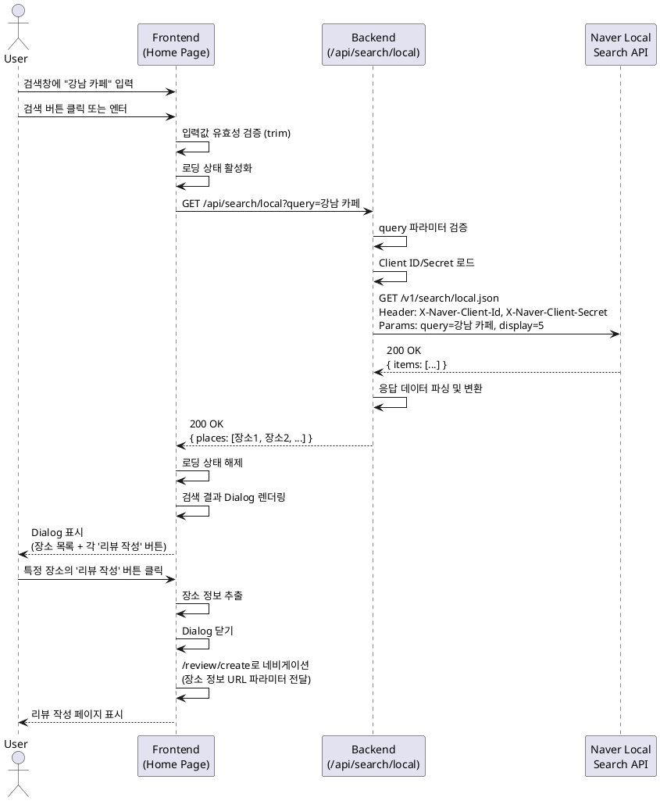

# 유스케이스: 장소 검색

## UC-002: 장소 검색 및 리뷰 작성 진입

### 1. 개요

사용자가 홈 페이지 검색창을 통해 장소를 검색하고, 검색 결과에서 원하는 장소를 선택하여 리뷰 작성 페이지로 이동하는 기능입니다.

---

## 2. Primary Actor

- **비회원 사용자**: 회원가입 없이 서비스를 이용하는 일반 사용자

---

## 3. Precondition

- 사용자가 홈 페이지(`/`)에 접속한 상태
- 네이버 지도 SDK가 정상적으로 로드된 상태
- 브라우저가 정상적으로 작동하는 상태

---

## 4. Trigger

- 사용자가 상단 검색창에 장소명을 입력하고 검색 버튼을 클릭하거나 엔터키를 누름

---

## 5. Main Scenario

### 5.1 검색 실행

1. **User**: 검색창에 장소명 입력 (예: "강남 카페")
2. **User**: 검색 버튼 클릭 또는 엔터키 입력
3. **FE**: 입력값 유효성 검증 (빈 문자열 체크, trim 처리)
4. **FE**: 로딩 상태 활성화 (버튼 비활성화, 스피너 표시)
5. **FE**: `/api/search/local?query={검색어}` 호출

### 5.2 검색 처리

6. **BE**: 요청 파라미터 검증 (`query` 존재 여부)
7. **BE**: 환경 변수에서 Client ID/Secret 로드
8. **BE**: 네이버 Local Search API 호출
   - 엔드포인트: `https://openapi.naver.com/v1/search/local.json`
   - 헤더: `X-Naver-Client-Id`, `X-Naver-Client-Secret`
   - 파라미터: `query={검색어}`, `display=5`
9. **BE**: API 응답 수신 및 파싱
10. **BE**: 장소 목록 데이터 변환 (최대 5개)
    - 각 장소: `placeId`, `placeName`, `address`, `roadAddress`, `category`, `latitude`, `longitude`

### 5.3 결과 표시

11. **FE**: 응답 데이터 수신
12. **FE**: 로딩 상태 해제
13. **FE**: 검색 결과 Dialog 렌더링
    - 각 장소 항목 표시:
      - 장소명
      - 주소 (도로명 우선, 없으면 지번)
      - 카테고리
      - '리뷰 작성' 버튼
14. **FE**: Dialog 외부 클릭 또는 닫기 버튼으로 닫기 가능

### 5.4 리뷰 작성 진입

15. **User**: Dialog에서 특정 장소의 '리뷰 작성' 버튼 클릭
16. **FE**: 선택한 장소 정보 추출
17. **FE**: 리뷰 작성 페이지로 네비게이션
    - URL: `/review/create?placeId={id}&placeName={name}&address={addr}&category={cat}&latitude={lat}&longitude={lng}`
18. **FE**: Dialog 닫기
19. **FE**: 페이지 전환 애니메이션 (1초 이내)

---

## 6. Alternative Flows

### 6.1 검색 결과 없음

- **분기점**: Main Scenario 단계 9 (API 응답 수신)
- **조건**: 네이버 API 응답의 `items` 배열이 비어있음
- **처리**:
  1. **BE**: HTTP 404 상태 코드와 함께 에러 응답 반환
  2. **FE**: Dialog에 "검색 결과가 없습니다. 다른 검색어로 시도해보세요." 메시지 표시
  3. **FE**: 검색창 입력값 유지 (재검색 편의)

### 6.2 검색창 빈 값 입력

- **분기점**: Main Scenario 단계 3 (입력값 검증)
- **조건**: trim 후 빈 문자열
- **처리**:
  1. **FE**: 에러 메시지 표시: "검색어를 입력해주세요."
  2. **FE**: 검색창에 포커스 이동
  3. **FE**: API 호출 중단

---

## 7. Exception Flows

### 7.1 네이버 API 호출 실패

**발생 조건**:
- 네이버 API 서버 장애
- 인증 정보 오류 (401)
- Rate Limit 초과 (429)
- 네트워크 타임아웃

**처리 방법**:
1. **BE**: HTTP 상태 코드별 에러 응답 반환
   - `400`: "잘못된 검색어입니다."
   - `401`: "인증 오류가 발생했습니다." (콘솔 로깅)
   - `429`: "요청이 너무 많습니다. 잠시 후 다시 시도해주세요."
   - `500`: "서버 오류가 발생했습니다."
   - `Timeout`: "검색 시간이 초과되었습니다."
2. **FE**: 에러 메시지를 Toast 또는 Dialog로 표시
3. **FE**: 재시도 버튼 제공 (429, 500, Timeout)
4. **FE**: 검색어 유지
5. **BE**: 에러 로깅 (Sentry 등)

**에러 코드**: `SEARCH_API_ERROR`

**사용자 메시지**: 상태 코드에 따라 상이 (위 참조)

### 7.2 환경 변수 누락

**발생 조건**:
- `.env.local` 파일 미설정
- Client ID/Secret 누락

**처리 방법**:
1. **BE**: HTTP 500 상태 코드 반환
2. **BE**: 콘솔 에러 로깅: "Missing API credentials"
3. **FE**: "일시적인 오류가 발생했습니다. 관리자에게 문의하세요." 메시지 표시

**에러 코드**: `MISSING_CREDENTIALS`

**사용자 메시지**: "일시적인 오류가 발생했습니다. 관리자에게 문의하세요."

### 7.3 장소 정보 불완전

**발생 조건**:
- 리뷰 작성 버튼 클릭 시 필수 필드 (`placeId`, `placeName`) 누락

**처리 방법**:
1. **FE**: 장소 정보 검증
2. **FE**: 에러 메시지 표시: "장소 정보가 올바르지 않습니다."
3. **FE**: 네비게이션 중단

**에러 코드**: `INVALID_PLACE_DATA`

**사용자 메시지**: "장소 정보가 올바르지 않습니다."

---

## 8. Post-conditions

### 8.1 성공 시

- **시스템 상태**:
  - 검색 결과 Dialog가 화면에 표시됨
  - 사용자가 선택한 장소 정보가 URL 파라미터로 전달됨
- **데이터베이스 변경**: 없음 (조회만 수행)
- **외부 시스템**: 네이버 Local Search API 호출 완료

### 8.2 실패 시

- **시스템 상태**:
  - 에러 메시지가 표시됨
  - 검색창 입력값 유지
- **데이터 롤백**: 해당 없음 (DB 변경 없음)

---

## 9. Business Rules

### BR-001: 검색 결과 제한
- 최대 5개의 장소만 표시
- 네이버 API의 `display` 파라미터를 5로 고정

### BR-002: 주소 우선순위
- 도로명 주소가 있으면 도로명 주소 우선 표시
- 없으면 지번 주소 표시

### BR-003: 검색어 처리
- 입력값은 trim 처리하여 공백 제거
- 빈 문자열은 검색 불가

### BR-004: 인증 정보 보안
- Client Secret은 서버에서만 사용
- 프론트엔드에 노출 금지 (`NEXT_PUBLIC_` 접두사 사용 금지)

### BR-005: 검색 API 최적화
- 디바운싱 적용 고려 (연속 입력 시 API 호출 최소화)
- 캐싱 전략 적용 (동일 검색어 재검색 시)

---

## 10. 비기능 요구사항

### 10.1 성능
- 검색 API 응답 시간: 2초 이내
- Dialog 렌더링 시간: 500ms 이내
- 페이지 전환 시간: 1초 이내

### 10.2 보안
- Client Secret은 서버 환경 변수로만 관리
- XSS 방지: 검색어 sanitize 처리
- CORS 설정: 허용된 도메인만 API 호출 가능

### 10.3 사용성
- 검색 중 로딩 스피너 표시
- 에러 메시지는 사용자 친화적 문구 사용
- 검색어 입력 후 엔터키로도 검색 가능
- Dialog 외부 클릭으로 닫기 가능

---

## 11. Sequence Diagram



---

## 12. API 명세

### 12.1 백엔드 API

#### Endpoint: `GET /api/search/local`

**요청 파라미터**:
- `query` (string, required): 검색할 장소명

**요청 예시**:
```
GET /api/search/local?query=강남%20카페
```

**응답 (성공 - 200 OK)**:
```json
{
  "places": [
    {
      "placeId": "12345",
      "placeName": "카페A",
      "address": "서울특별시 강남구 테헤란로 123",
      "roadAddress": "서울특별시 강남구 테헤란로 123",
      "category": "음식점>카페,디저트",
      "latitude": 37.5665,
      "longitude": 126.9780
    },
    ...
  ]
}
```

**응답 (실패 - 400 Bad Request)**:
```json
{
  "error": "Query parameter is required"
}
```

**응답 (실패 - 404 Not Found)**:
```json
{
  "error": "No results found"
}
```

**응답 (실패 - 500 Internal Server Error)**:
```json
{
  "error": "Failed to fetch search results"
}
```

### 12.2 외부 API (네이버 Local Search)

#### Endpoint: `GET https://openapi.naver.com/v1/search/local.json`

**요청 헤더**:
- `X-Naver-Client-Id`: Client ID
- `X-Naver-Client-Secret`: Client Secret

**요청 파라미터**:
- `query` (string, required): 검색어
- `display` (number, optional): 검색 결과 개수 (기본값: 5, 최대: 5)

**응답 예시**:
```json
{
  "lastBuildDate": "Tue, 21 Oct 2025 12:34:56 +0900",
  "total": 1234,
  "start": 1,
  "display": 5,
  "items": [
    {
      "title": "카페A",
      "link": "https://...",
      "category": "음식점>카페,디저트",
      "description": "",
      "telephone": "",
      "address": "서울특별시 강남구 역삼동 123-45",
      "roadAddress": "서울특별시 강남구 테헤란로 123",
      "mapx": "1269780",
      "mapy": "375665"
    },
    ...
  ]
}
```

---

## 13. UI 요구사항

### 13.1 검색창
- 위치: 홈 페이지 상단
- 플레이스홀더: "장소명을 검색하세요"
- 입력 타입: 텍스트
- 최대 길이: 100자
- 스타일:
  - 너비: 화면 너비의 80% (최대 300px)
  - 높이: 44px (터치 타겟 최소 크기)
  - 테두리: 1px solid #ddd
  - 패딩: 10px

### 13.2 검색 버튼
- 텍스트: "검색"
- 타입: Submit
- 위치: 검색창 우측
- 스타일:
  - 배경색: #03c75a (네이버 초록색)
  - 텍스트색: #fff
  - 패딩: 10px 20px
  - 로딩 중: 배경색 #ccc, 커서 not-allowed

### 13.3 검색 결과 Dialog
- 모달 형태 (배경 dim 처리)
- 최대 너비: 360px (모바일 최적화)
- 최대 높이: 500px (스크롤 가능)
- 닫기 방법:
  - Dialog 외부 클릭
  - 우측 상단 X 버튼
  - ESC 키
- 각 장소 항목:
  - 장소명: 16px, bold
  - 주소: 14px, #666
  - 카테고리: 12px, #999
  - '리뷰 작성' 버튼: 14px, #03c75a

---

## 14. 테스트 시나리오

### 14.1 성공 케이스

| 테스트 케이스 ID | 입력값 | 기대 결과 |
|----------------|--------|----------|
| TC-002-01 | "강남 카페" | 검색 결과 Dialog에 최대 5개 장소 표시 |
| TC-002-02 | "경복궁" | 검색 결과 Dialog에 경복궁 관련 장소 표시 |
| TC-002-03 | Dialog에서 '리뷰 작성' 버튼 클릭 | 리뷰 작성 페이지로 이동, URL 파라미터 포함 |

### 14.2 실패 케이스

| 테스트 케이스 ID | 입력값 | 기대 결과 |
|----------------|--------|----------|
| TC-002-04 | "" (빈 문자열) | "검색어를 입력해주세요." 에러 메시지 |
| TC-002-05 | "   " (공백만) | "검색어를 입력해주세요." 에러 메시지 |
| TC-002-06 | "존재하지않는장소12345" | "검색 결과가 없습니다." 메시지 |
| TC-002-07 | 네이버 API 서버 장애 | "검색 결과를 불러올 수 없습니다." 에러 메시지 |

### 14.3 엣지 케이스

| 테스트 케이스 ID | 입력값 | 기대 결과 |
|----------------|--------|----------|
| TC-002-08 | 특수문자 포함 ("카페@#$") | 정상 검색 (XSS 방지 처리) |
| TC-002-09 | 매우 긴 검색어 (100자 초과) | 100자까지만 입력 허용 |
| TC-002-10 | 검색 버튼 빠른 연속 클릭 | 중복 API 호출 방지, 첫 번째만 실행 |

---

## 15. 관련 유스케이스

- **선행 유스케이스**: UC-001 (홈 페이지 진입 및 지도 표시)
- **후행 유스케이스**: UC-003 (리뷰 작성)
- **연관 유스케이스**: UC-004 (장소 상세 조회)

---

## 16. 변경 이력

| 버전 | 날짜 | 작성자 | 변경 내용 |
|------|------|--------|-----------|
| 1.0 | 2025-10-21 | Development Team | 초기 작성 |

---

## 부록

### A. 용어 정의

- **Dialog**: 모달 팝업 형태의 UI 요소
- **Geocoding**: 주소를 위도·경도 좌표로 변환하는 과정
- **Client ID/Secret**: 네이버 API 인증에 사용되는 식별자 및 비밀키
- **Sanitize**: 악의적인 스크립트 제거 및 안전한 형태로 변환

### B. 참고 자료

- [네이버 Local Search API 문서](https://developers.naver.com/docs/serviceapi/search/local/local.md)
- [네이버 클라우드 플랫폼 Maps 가이드](https://guide.ncloud-docs.com/docs/maps-overview)
- [Next.js 15 API Routes 문서](https://nextjs.org/docs/app/building-your-application/routing/route-handlers)
- PRD: `/docs/prd.md`
- Userflow: `/docs/userflow.md` (Section 3.1.4)
