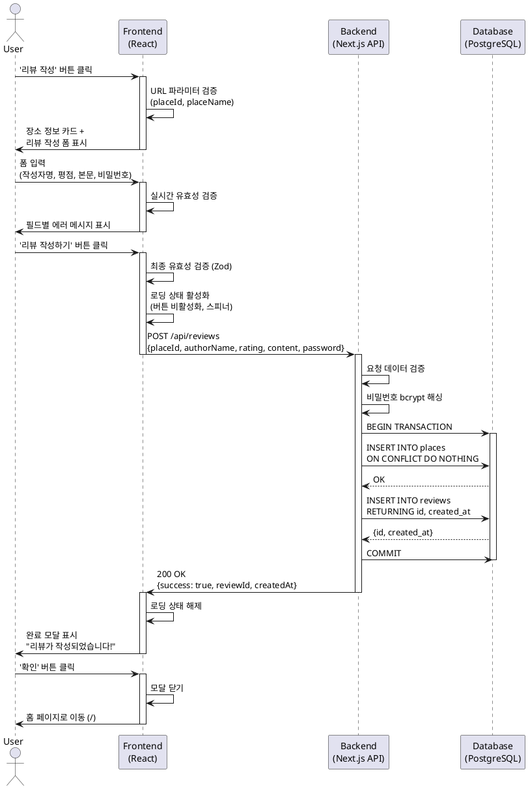

# 유스케이스: UC-003 리뷰 작성

## Primary Actor
비회원 사용자 (맛집 방문자)

## Precondition
- 사용자가 장소 검색을 통해 특정 장소를 선택했거나, 지도에서 마커를 통해 장소 상세 페이지를 조회한 상태
- 리뷰를 작성하려는 장소의 placeId가 확보된 상태
- 브라우저가 JavaScript를 실행할 수 있는 환경

## Trigger
사용자가 '리뷰 작성' 버튼을 클릭하여 `/review/create` 페이지로 진입

---

## Main Scenario

### 1. 페이지 진입 및 로딩
**User**: 검색 결과 Dialog 또는 장소 상세 페이지에서 '리뷰 작성' 버튼 클릭

**FE**:
- URL 쿼리 파라미터로 장소 정보 수신 (placeId, placeName, address, category 등)
- 필수 파라미터(placeId, placeName) 검증
- 장소 정보 카드 렌더링
- 리뷰 작성 폼 초기화 (React Hook Form + Zod)

### 2. 리뷰 정보 입력
**User**: 폼 필드에 데이터 입력
- 작성자명 (1~20자)
- 평점 (1~5점 별점 선택)
- 리뷰 본문 (10~500자)
- 임시 비밀번호 (4~20자)

**FE**:
- 실시간 유효성 검증 (onChange/onBlur)
- 필드별 에러 메시지 표시
- 글자 수 카운터 표시 (작성자명, 본문)
- 모든 필드가 유효할 경우 제출 버튼 활성화

### 3. 리뷰 제출
**User**: '리뷰 작성하기' 버튼 클릭

**FE**:
- 최종 유효성 검증 (Zod 스키마)
- 로딩 상태 활성화 (버튼 비활성화, 스피너 표시)
- POST `/api/reviews` 호출
  ```json
  {
    "placeId": "12345",
    "placeName": "카페 이름",
    "address": "서울시 강남구...",
    "authorName": "김민지",
    "rating": 5,
    "content": "분위기도 좋고 커피도 맛있어요...",
    "password": "1234"
  }
  ```

**BE**:
- 요청 데이터 검증 (Zod 스키마)
- 비밀번호 bcrypt 해싱 (salt rounds: 10)
- 데이터베이스 트랜잭션 시작

**Database**:
```sql
BEGIN;

-- 장소 정보 UPSERT (중복 시 무시)
INSERT INTO places (place_id, name, address, category, latitude, longitude)
VALUES ($1, $2, $3, $4, $5, $6)
ON CONFLICT (place_id) DO NOTHING;

-- 리뷰 INSERT
INSERT INTO reviews (place_id, author_name, rating, content, password_hash)
VALUES ($1, $2, $3, $4, $5)
RETURNING id, created_at;

COMMIT;
```

**BE → FE**: 성공 응답
```json
{
  "success": true,
  "reviewId": "uuid-value",
  "createdAt": "2025-10-21T12:34:56Z"
}
```

### 4. 작성 완료
**FE**:
- 로딩 상태 해제
- 완료 모달 표시
  - 제목: "리뷰가 작성되었습니다!"
  - 내용: "소중한 리뷰 감사합니다."
  - 확인 버튼

**User**: 완료 모달의 '확인' 버튼 클릭

**FE**:
- 모달 닫기
- 홈 페이지 (`/`)로 네비게이션
- 작성한 장소에 마커가 표시됨

---

## Edge Cases

### EC-1: 필수 URL 파라미터 누락
**발생 조건**: `placeId` 또는 `placeName` 파라미터가 URL에 없는 경우

**처리**:
- 에러 페이지 표시 또는 홈으로 자동 리다이렉트
- 에러 메시지: "잘못된 접근입니다. 장소 정보를 찾을 수 없습니다."

### EC-2: 유효성 검증 실패
**발생 조건**:
- 작성자명이 공백만 포함
- 평점 미선택
- 본문이 10자 미만 또는 500자 초과
- 비밀번호가 4자 미만

**처리**:
- 제출 차단
- 필드별 에러 메시지 표시
- 해당 필드에 포커스 이동

### EC-3: 리뷰 저장 실패
**발생 조건**:
- 데이터베이스 연결 오류
- 트랜잭션 실패
- 네트워크 중단

**처리**:
- 에러 메시지 표시: "리뷰 작성에 실패했습니다. 다시 시도해주세요."
- 로딩 상태 해제
- 입력값 유지 (재작성 방지)
- 재시도 버튼 제공

### EC-4: 중복 제출 방지
**발생 조건**: 사용자가 제출 버튼을 빠르게 여러 번 클릭

**처리**:
- 첫 클릭 시 버튼 즉시 비활성화
- 로딩 중 추가 클릭 무시
- API 호출 중복 방지

### EC-5: XSS 공격 시도
**발생 조건**: 사용자가 `<script>` 태그 등 악의적 코드 입력

**처리**:
- 프론트엔드: 입력 허용 (UX 저하 방지)
- 백엔드: HTML 태그 이스케이프 처리
- 데이터베이스: 텍스트로 저장
- 출력 시: 텍스트로만 렌더링 (dangerouslySetInnerHTML 사용 금지)

---

## Business Rules

### BR-1: 리뷰 작성 권한
- 회원가입 없이 누구나 리뷰 작성 가능
- 작성 시 임시 비밀번호 설정 (향후 수정/삭제 기능용)

### BR-2: 입력 제약사항
- 작성자명: 1~20자, 공백만 불가
- 평점: 1~5 중 필수 선택
- 본문: 10~500자
- 비밀번호: 4~20자

### BR-3: 보안 정책
- 비밀번호는 bcrypt 해싱 후 저장 (salt rounds: 10)
- 평문 비밀번호는 절대 저장 금지
- XSS 방지를 위한 입력값 sanitize

### BR-4: 데이터 무결성
- 리뷰 작성 시 장소 정보가 없으면 자동 생성 (UPSERT)
- 트랜잭션으로 장소 생성과 리뷰 저장 원자성 보장
- 외래키 제약으로 데이터 정합성 유지

### BR-5: 사용자 경험
- 리뷰 작성 시간: 2분 이내 완료 목표
- 입력 오류 시 재작성 최소화 (입력값 유지)
- 저장 실패 시 명확한 에러 메시지 제공

---

## Sequence Diagram (PlantUML)



---

## Post-conditions

### 성공 시
- **Database**:
  - `places` 테이블에 장소 정보 존재 (신규 생성 또는 기존 유지)
  - `reviews` 테이블에 새 리뷰 레코드 추가
  - 리뷰 ID(UUID)와 작성 시각 자동 생성

- **System State**:
  - 사용자가 홈 페이지에 위치
  - 작성한 장소에 마커 표시됨 (신규 장소의 경우 새 마커 추가)

- **User Experience**:
  - 사용자는 작성한 리뷰가 저장되었음을 인지
  - 장소 상세 페이지에서 작성한 리뷰 확인 가능

### 실패 시
- **Database**:
  - 트랜잭션 롤백으로 데이터 변경 없음
  - 데이터 무결성 유지

- **System State**:
  - 사용자가 리뷰 작성 페이지에 유지
  - 입력값 보존 (재작성 방지)

- **User Experience**:
  - 에러 메시지를 통해 실패 원인 인지
  - 재시도 가능

---

## Non-functional Requirements

### Performance
- 리뷰 저장 API 응답 시간: 1초 이내
- 페이지 로딩 시간: 1초 이내
- 입력 유효성 검증: 실시간 (지연 없음)

### Security
- 비밀번호 bcrypt 해싱 (salt rounds: 10)
- XSS 방지: HTML 태그 이스케이프 처리
- CSRF 방지: Next.js 기본 보호 기능 활용
- Rate Limiting: IP당 분당 60회 제한 (향후 적용)

### Usability
- 모바일 최적화: 최대 너비 360px, 최대 높이 720px
- 터치 타겟 최소 크기: 44x44px
- 명확한 에러 메시지 제공
- 입력 중 글자 수 카운터 표시

### Accessibility
- 키보드 네비게이션 지원
- 스크린 리더 호환성
- 색상 대비 비율 4.5:1 이상
- 명확한 폼 레이블 및 placeholder

---

## Related Use Cases

- **선행 유스케이스**:
  - UC-002: 장소 검색 (검색 결과에서 리뷰 작성 진입)
  - UC-004: 장소 상세 조회 (상세 페이지에서 리뷰 작성 진입)

- **후행 유스케이스**:
  - UC-001: 홈 페이지 지도 조회 (작성 완료 후 이동)
  - UC-004: 장소 상세 조회 (작성한 리뷰 확인)

- **연관 유스케이스**:
  - UC-005: 리뷰 수정 (향후 구현, 비밀번호 인증 필요)
  - UC-006: 리뷰 삭제 (향후 구현, 비밀번호 인증 필요)

---

## API Specification

### POST /api/reviews

**Request Headers**:
```
Content-Type: application/json
```

**Request Body**:
```typescript
{
  placeId: string;        // 네이버 장소 ID
  placeName: string;      // 장소명
  address: string;        // 주소
  category?: string;      // 카테고리 (선택)
  latitude?: number;      // 위도 (선택)
  longitude?: number;     // 경도 (선택)
  authorName: string;     // 작성자명 (1~20자)
  rating: number;         // 평점 (1~5)
  content: string;        // 본문 (10~500자)
  password: string;       // 평문 비밀번호 (4~20자)
}
```

**Response (성공)**:
```json
{
  "success": true,
  "reviewId": "550e8400-e29b-41d4-a716-446655440000",
  "createdAt": "2025-10-21T12:34:56.789Z"
}
```

**Response (실패)**:
```json
{
  "success": false,
  "error": "Validation failed",
  "details": [
    {
      "field": "content",
      "message": "리뷰는 10~500자로 작성해주세요"
    }
  ]
}
```

**HTTP Status Codes**:
- `201 Created`: 리뷰 작성 성공
- `400 Bad Request`: 입력값 검증 실패
- `500 Internal Server Error`: 서버 오류

---

## Database Schema Reference

### places 테이블
```sql
CREATE TABLE places (
    place_id TEXT PRIMARY KEY,
    name TEXT NOT NULL,
    address TEXT NOT NULL,
    category TEXT,
    latitude NUMERIC(10, 7) NOT NULL,
    longitude NUMERIC(10, 7) NOT NULL,
    created_at TIMESTAMPTZ DEFAULT NOW() NOT NULL
);
```

### reviews 테이블
```sql
CREATE TABLE reviews (
    id UUID PRIMARY KEY DEFAULT gen_random_uuid(),
    place_id TEXT NOT NULL REFERENCES places(place_id) ON DELETE CASCADE,
    author_name TEXT NOT NULL,
    rating SMALLINT NOT NULL CHECK (rating >= 1 AND rating <= 5),
    content TEXT NOT NULL,
    password_hash TEXT NOT NULL,
    created_at TIMESTAMPTZ DEFAULT NOW() NOT NULL
);
```

---

## Test Scenarios

### 성공 케이스

| Test ID | 입력값 | 기대 결과 |
|---------|--------|-----------|
| TC-003-01 | 작성자명: "김민지"<br>평점: 5<br>본문: "분위기도 좋고 커피도 맛있어요. 재방문 의사 100%!"<br>비밀번호: "1234" | HTTP 201, 리뷰 저장 성공, 완료 모달 표시 |
| TC-003-02 | 작성자명: "박준호"<br>평점: 4<br>본문: "가격 대비 괜찮습니다."<br>비밀번호: "test1234" | HTTP 201, 리뷰 저장 성공 |

### 실패 케이스

| Test ID | 입력값 | 기대 결과 |
|---------|--------|-----------|
| TC-003-03 | 작성자명: "" (빈 문자열) | "작성자명을 입력해주세요" 에러 메시지 |
| TC-003-04 | 본문: "짧음" (5자) | "리뷰는 10~500자로 작성해주세요" 에러 메시지 |
| TC-003-05 | 평점: 미선택 | "평점을 선택해주세요" 에러 메시지 |
| TC-003-06 | 비밀번호: "123" (3자) | "비밀번호는 4~20자로 입력해주세요" 에러 메시지 |
| TC-003-07 | 작성자명: "A".repeat(21) (21자) | "작성자명은 1~20자로 입력해주세요" 에러 메시지 |
| TC-003-08 | 본문: "A".repeat(501) (501자) | "리뷰는 10~500자로 작성해주세요" 에러 메시지 |

---

## Change History

| 버전 | 날짜 | 작성자 | 변경 내용 |
|------|------|--------|-----------|
| 1.0.0 | 2025-10-21 | Development Team | 초기 작성 |

---

## 부록

### A. 용어 정의
- **비회원 리뷰**: 회원가입 없이 임시 비밀번호로 작성하는 리뷰
- **임시 비밀번호**: 향후 리뷰 수정/삭제 시 사용할 인증 수단
- **bcrypt 해싱**: 비밀번호 암호화 알고리즘 (단방향 해시 함수)
- **UPSERT**: INSERT + UPDATE (존재하면 업데이트, 없으면 삽입)

### B. 참고 자료
- [PRD 문서](/docs/prd.md)
- [Userflow 문서](/docs/userflow.md)
- [Database 설계 문서](/docs/database.md)
- [React Hook Form 공식 문서](https://react-hook-form.com/)
- [Zod 공식 문서](https://zod.dev/)
- [bcrypt.js GitHub](https://github.com/kelektiv/node.bcrypt.js)
