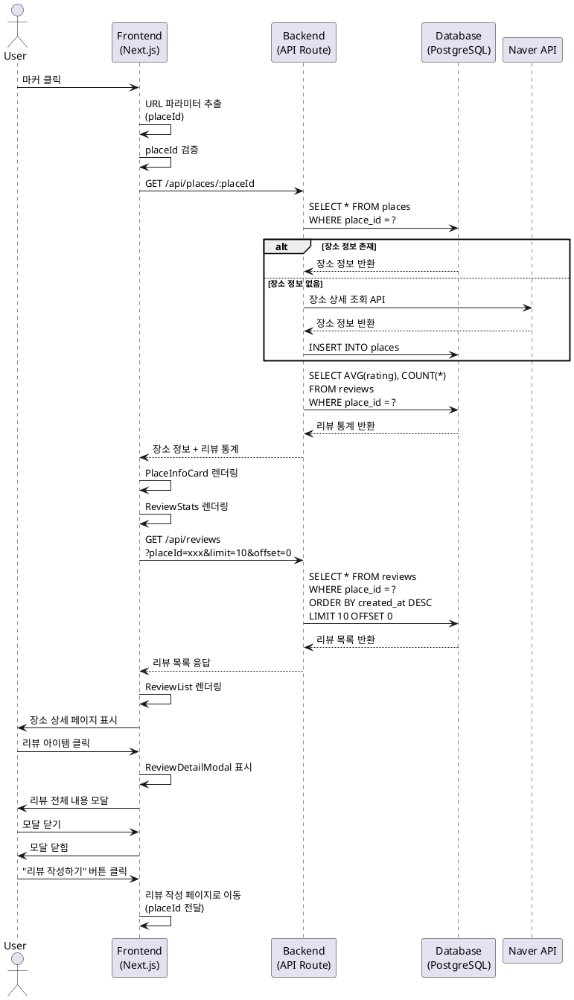

# 유스케이스 명세: 장소 상세 및 리뷰 조회

## 유스케이스 ID: UC-004

### 제목
장소 상세 정보 및 리뷰 목록 조회

---

## 1. 개요

### 1.1 목적
사용자가 지도에서 선택한 장소의 상세 정보와 해당 장소에 작성된 리뷰 목록을 조회하여, 방문 결정에 필요한 정보를 제공한다.

### 1.2 범위
- 장소 기본 정보 표시 (장소명, 주소, 카테고리)
- 리뷰 통계 표시 (평균 평점, 리뷰 개수)
- 리뷰 목록 조회 (최신순 정렬, 페이지네이션)
- 리뷰 아이템 클릭 시 상세 모달 표시
- 리뷰 작성 페이지로 이동 기능

**제외 사항**:
- 리뷰 수정/삭제 기능
- 리뷰 좋아요/댓글 기능
- 리뷰 정렬 옵션 변경 (최신순 고정)
- 리뷰 필터링 기능

### 1.3 액터
- **주요 액터**: 비회원 사용자
- **부 액터**:
  - 네이버 장소검색 API (장소 정보 조회)
  - PostgreSQL Database (리뷰 데이터 조회)

---

## 2. 선행 조건

- 사용자가 홈 페이지에서 마커를 클릭하여 placeId가 URL 파라미터로 전달됨
- 또는 검색 결과에서 장소를 선택하여 페이지에 접근
- placeId는 유효한 네이버 장소 ID여야 함
- 브라우저가 정상적으로 작동하며 네트워크 연결이 가능함

---

## 3. 참여 컴포넌트

### 3.1 프론트엔드
- **PlaceDetailPage**: 장소 상세 페이지 메인 컴포넌트
- **PlaceInfoCard**: 장소 정보 표시 컴포넌트
- **ReviewStats**: 평균 평점 및 리뷰 개수 표시 컴포넌트
- **ReviewList**: 리뷰 목록 표시 컴포넌트 (무한 스크롤 또는 페이지네이션)
- **ReviewItem**: 개별 리뷰 아이템 컴포넌트
- **ReviewDetailModal**: 리뷰 전체 내용 표시 모달

### 3.2 백엔드 (API)
- **GET /api/places/:placeId**: 장소 정보 및 리뷰 통계 조회
- **GET /api/reviews?placeId={id}&limit={n}&offset={m}**: 리뷰 목록 조회 (페이지네이션)

### 3.3 외부 서비스
- **네이버 장소검색 API**: 장소 상세 정보 조회 (또는 DB 캐시 사용)

### 3.4 데이터베이스
- **places 테이블**: 장소 기본 정보 저장
- **reviews 테이블**: 리뷰 데이터 저장

---

## 4. 기본 플로우 (Basic Flow)

### 4.1 단계별 흐름

#### 단계 1: 페이지 진입
- **사용자**: 홈 페이지에서 마커 클릭 또는 검색 결과에서 장소 선택
- **입력**: placeId (URL 파라미터)
- **처리**: Next.js Router를 통해 `/place/detail?placeId={id}` 페이지로 이동
- **출력**: 장소 상세 페이지 로딩 시작

#### 단계 2: URL 파라미터 검증
- **프론트엔드**: URL에서 placeId 파라미터 추출
- **입력**: URL 쿼리 파라미터
- **처리**:
  - placeId 존재 여부 확인
  - 유효성 검증 (빈 문자열 체크)
- **출력**:
  - 성공: 다음 단계 진행
  - 실패: 에러 페이지 표시 및 홈으로 리다이렉트

#### 단계 3: 장소 정보 및 리뷰 통계 조회
- **프론트엔드**: `GET /api/places/:placeId` API 호출
- **백엔드**:
  1. placeId로 places 테이블 조회
  2. 장소 정보가 DB에 없으면 네이버 API 호출하여 조회
  3. reviews 테이블에서 해당 장소의 리뷰 통계 계산
     - 평균 평점: `AVG(rating)`
     - 리뷰 개수: `COUNT(*)`
  4. 응답 데이터 구성 및 반환
- **출력**:
  ```json
  {
    "placeId": "12345",
    "name": "OO식당",
    "address": "서울시 강남구...",
    "category": "한식",
    "latitude": 37.5665,
    "longitude": 126.9780,
    "reviewCount": 23,
    "averageRating": 4.2
  }
  ```

#### 단계 4: 장소 정보 표시
- **프론트엔드**: PlaceInfoCard 컴포넌트 렌더링
- **입력**: API 응답 데이터
- **처리**: UI 요소 렌더링
- **출력**:
  - 장소명
  - 주소 (도로명 우선)
  - 카테고리
  - 지도 미리보기 (선택적)

#### 단계 5: 리뷰 통계 표시
- **프론트엔드**: ReviewStats 컴포넌트 렌더링
- **입력**: 평균 평점, 리뷰 개수
- **처리**: 별점 UI 및 숫자 표시
- **출력**:
  - 평균 평점: ★★★★☆ 4.2
  - 리뷰 개수: "23개 리뷰"

#### 단계 6: 리뷰 목록 조회
- **프론트엔드**: `GET /api/reviews?placeId={id}&limit=10&offset=0` API 호출
- **백엔드**:
  1. placeId로 reviews 테이블 조회
  2. 최신순 정렬 (`ORDER BY created_at DESC`)
  3. 페이지네이션 적용 (`LIMIT 10 OFFSET 0`)
  4. 응답 데이터 반환
- **출력**:
  ```json
  {
    "reviews": [
      {
        "id": "uuid-1",
        "authorName": "김민지",
        "rating": 5,
        "content": "정말 맛있어요...",
        "createdAt": "2025-10-20T14:30:00Z"
      },
      ...
    ],
    "total": 23
  }
  ```

#### 단계 7: 리뷰 목록 표시
- **프론트엔드**: ReviewList 컴포넌트 렌더링
- **입력**: 리뷰 배열
- **처리**: 각 리뷰를 ReviewItem 컴포넌트로 렌더링
- **출력**:
  - 작성자명
  - 평점 (별점)
  - 리뷰 본문 (100자까지 표시, 이후 "..." 처리)
  - 작성일 (YYYY.MM.DD 형식)

#### 단계 8: 리뷰 작성 버튼 표시
- **프론트엔드**: "리뷰 작성하기" 버튼 렌더링
- **출력**: 버튼 UI 표시

### 4.2 시퀀스 다이어그램



---

## 5. 대안 플로우 (Alternative Flows)

### 5.1 대안 플로우 1: 리뷰 없는 장소

**시작 조건**: 단계 6에서 리뷰 개수가 0개인 경우

**단계**:
1. API 응답에서 `reviews: []`, `total: 0` 확인
2. 빈 상태 UI 표시
   - 메시지: "아직 작성된 리뷰가 없습니다."
   - 서브 메시지: "첫 번째 리뷰를 작성해보세요!"
3. "첫 리뷰 작성하기" 버튼 강조 표시
4. 평균 평점은 "-" 또는 "평점 없음" 표시

**결과**: 사용자가 리뷰 작성 페이지로 이동 가능

### 5.2 대안 플로우 2: 무한 스크롤 (추가 리뷰 로드)

**시작 조건**: 사용자가 리뷰 목록을 스크롤하여 하단에 도달

**단계**:
1. 스크롤 하단 도달 감지
2. 현재 오프셋 계산 (현재 로드된 리뷰 개수)
3. `GET /api/reviews?placeId={id}&limit=10&offset={현재개수}` API 호출
4. 추가 리뷰 데이터 수신
5. 기존 리스트에 append하여 렌더링
6. 더 이상 리뷰가 없으면 "모든 리뷰를 확인했습니다" 메시지 표시

**결과**: 리뷰 목록이 점진적으로 확장됨

### 5.3 대안 플로우 3: 장소 정보 캐시 사용

**시작 조건**: 단계 3에서 장소 정보가 DB에 이미 존재

**단계**:
1. places 테이블 조회 성공
2. 네이버 API 호출 생략
3. DB 데이터로 응답 생성

**결과**: API 호출 비용 절감 및 응답 속도 향상

---

## 6. 예외 플로우 (Exception Flows)

### 6.1 예외 상황 1: placeId 파라미터 누락

**발생 조건**: URL에 placeId 쿼리 파라미터가 없음

**처리 방법**:
1. 페이지 로딩 시 파라미터 검증
2. 에러 페이지 표시
3. 3초 후 자동으로 홈 페이지로 리다이렉트

**에러 코드**: `400 Bad Request`

**사용자 메시지**: "잘못된 접근입니다. 홈으로 이동합니다."

### 6.2 예외 상황 2: 장소 정보 조회 실패

**발생 조건**:
- DB에 장소 정보 없음
- 네이버 API 호출 실패 (네트워크 오류, 인증 오류 등)

**처리 방법**:
1. 에러 로깅 (콘솔 또는 Sentry)
2. 에러 메시지 표시: "장소 정보를 불러올 수 없습니다."
3. 재시도 버튼 제공
4. 또는 최소한의 정보만 표시 (placeId, placeName)

**에러 코드**: `500 Internal Server Error` 또는 `404 Not Found`

**사용자 메시지**: "장소 정보를 불러올 수 없습니다. 다시 시도해주세요."

### 6.3 예외 상황 3: 리뷰 목록 조회 실패

**발생 조건**:
- DB 연결 오류
- 쿼리 실행 실패
- 네트워크 타임아웃

**처리 방법**:
1. 에러 로깅
2. 에러 메시지 표시: "리뷰를 불러올 수 없습니다."
3. 재시도 버튼 제공
4. 장소 정보는 정상 표시 유지

**에러 코드**: `500 Internal Server Error`

**사용자 메시지**: "리뷰를 불러올 수 없습니다. 잠시 후 다시 시도해주세요."

### 6.4 예외 상황 4: 네트워크 연결 끊김 (무한 스크롤 중)

**발생 조건**: 추가 리뷰 로드 중 네트워크 오류 발생

**처리 방법**:
1. 로딩 스피너 제거
2. 에러 메시지 Toast 표시: "네트워크 연결을 확인해주세요."
3. 재시도 버튼 표시
4. 기존 로드된 리뷰는 유지

**에러 코드**: `네트워크 오류`

**사용자 메시지**: "네트워크 연결을 확인해주세요."

### 6.5 예외 상황 5: 평균 평점 계산 오류

**발생 조건**: 리뷰 개수가 0이지만 평균 평점 계산 시도

**처리 방법**:
1. 백엔드에서 `COALESCE` 또는 조건문으로 처리
2. 리뷰 개수 0이면 평균 평점 null 또는 0 반환
3. 프론트엔드에서 null 체크 후 "-" 또는 "평점 없음" 표시

**에러 코드**: 없음 (정상 처리)

**사용자 메시지**: 평점 대신 "-" 표시

---

## 7. 후행 조건 (Post-conditions)

### 7.1 성공 시

**데이터베이스 변경**: 없음 (조회만 수행)

**시스템 상태**:
- 사용자에게 장소 정보 및 리뷰 목록이 표시됨
- 사용자는 리뷰 작성 페이지로 이동 가능
- 리뷰 아이템 클릭 시 상세 모달 표시 가능

**외부 시스템**:
- 네이버 API 호출 횟수 증가 (장소 정보가 DB에 없었던 경우)

### 7.2 실패 시

**데이터 롤백**: 해당 없음 (조회만 수행)

**시스템 상태**:
- 에러 메시지가 표시됨
- 사용자는 재시도 또는 홈으로 이동 가능
- 부분적 성공 시 장소 정보만 표시되고 리뷰는 에러 상태

---

## 8. 비기능 요구사항

### 8.1 성능

- **페이지 로딩 시간**: 3초 이내
- **장소 정보 API 응답 시간**: 1초 이내
- **리뷰 목록 API 응답 시간**: 1초 이내
- **무한 스크롤 추가 로드**: 500ms 이내
- **리뷰 개수가 많아도 (1000개 이상) 성능 저하 없음** (페이지네이션으로 해결)

### 8.2 보안

- **인증**: 비회원 조회는 인증 불필요
- **권한**: 모든 사용자가 조회 가능
- **XSS 방지**: 리뷰 본문 출력 시 HTML 이스케이프 처리
- **SQL Injection 방지**: Parameterized Query 사용

### 8.3 가용성

- **시스템 가동 시간**: 99.9% 이상
- **장애 복구 시간**: 1시간 이내
- **네이버 API 장애 시 대응**: DB 캐시 데이터로 fallback

### 8.4 사용성

- **반응형 디자인**: 모바일 최적화 (360x720)
- **접근성**: WCAG 2.1 AA 수준 준수
- **로딩 상태**: 스피너 표시로 사용자에게 피드백 제공
- **에러 메시지**: 사용자 친화적 문구 사용

---

## 9. UI/UX 요구사항

### 9.1 화면 구성

**레이아웃**:
```
+----------------------------------+
| ← 뒤로가기                        |
+----------------------------------+
| [장소 정보 카드]                   |
| 장소명: OO식당                    |
| 주소: 서울시 강남구...             |
| 카테고리: 한식                     |
+----------------------------------+
| 평균 평점: ★★★★☆ 4.2             |
| 리뷰 개수: 23개                   |
|         [리뷰 작성하기]            |
+----------------------------------+
| [리뷰 목록]                       |
| ┌────────────────────────────┐  |
| │ 김민지 ★★★★★                │  |
| │ 정말 맛있어요...             │  |
| │ 2025.10.20                  │  |
| └────────────────────────────┘  |
| ┌────────────────────────────┐  |
| │ 박준호 ★★★★☆                │  |
| │ 괜찮은 맛집...               │  |
| │ 2025.10.19                  │  |
| └────────────────────────────┘  |
|                                  |
| [더 보기 / 로딩 스피너]            |
+----------------------------------+
```

**UI 요소**:
- 뒤로가기 버튼 (좌측 상단)
- 장소 정보 카드 (고정 영역)
- 리뷰 통계 (평균 평점 별점 + 숫자, 리뷰 개수)
- "리뷰 작성하기" 버튼 (강조 색상)
- 리뷰 목록 (스크롤 가능 영역)
- 리뷰 아이템 (카드 UI, 클릭 가능)
- 로딩 스피너 (무한 스크롤 시)
- 빈 상태 UI (리뷰 없을 때)

### 9.2 사용자 경험

**인터랙션**:
- 뒤로가기 버튼 클릭 시 이전 페이지로 이동
- 리뷰 아이템 클릭 시 상세 모달 표시 (애니메이션)
- 모달 외부 클릭 또는 닫기 버튼으로 모달 닫기
- "리뷰 작성하기" 버튼 클릭 시 리뷰 작성 페이지로 이동
- 스크롤 하단 도달 시 자동으로 추가 리뷰 로드 (무한 스크롤)

**피드백**:
- 로딩 중 스피너 표시
- 에러 발생 시 Toast 또는 Alert 메시지
- 빈 상태 UI에 일러스트레이션 추가 (선택적)
- 터치 타겟 최소 크기 44x44px (Apple HIG)

**성능 최적화**:
- 리뷰 이미지 lazy loading (향후 이미지 기능 추가 시)
- 무한 스크롤 디바운스 적용
- 리뷰 아이템 가상화 (react-window 등, 리뷰 개수가 매우 많을 경우)

---

## 10. 데이터 명세

### 10.1 API 요청/응답

#### GET /api/places/:placeId

**요청**:
```
GET /api/places/12345
```

**응답 (성공)**:
```json
{
  "success": true,
  "data": {
    "placeId": "12345",
    "name": "OO식당",
    "address": "서울시 강남구 테헤란로 123",
    "category": "한식",
    "latitude": 37.5665,
    "longitude": 126.9780,
    "reviewCount": 23,
    "averageRating": 4.2
  }
}
```

**응답 (실패)**:
```json
{
  "success": false,
  "error": "PLACE_NOT_FOUND",
  "message": "장소 정보를 찾을 수 없습니다."
}
```

#### GET /api/reviews

**요청**:
```
GET /api/reviews?placeId=12345&limit=10&offset=0
```

**쿼리 파라미터**:
- `placeId` (필수): 장소 ID
- `limit` (선택, 기본값 10): 한 번에 조회할 리뷰 개수
- `offset` (선택, 기본값 0): 건너뛸 리뷰 개수

**응답 (성공)**:
```json
{
  "success": true,
  "data": {
    "reviews": [
      {
        "id": "uuid-1",
        "authorName": "김민지",
        "rating": 5,
        "content": "정말 맛있어요. 재방문 의사 100%!",
        "createdAt": "2025-10-20T14:30:00Z"
      },
      {
        "id": "uuid-2",
        "authorName": "박준호",
        "rating": 4,
        "content": "괜찮은 맛집이에요. 다만 웨이팅이 좀 있어요.",
        "createdAt": "2025-10-19T12:15:00Z"
      }
    ],
    "total": 23,
    "limit": 10,
    "offset": 0,
    "hasMore": true
  }
}
```

**응답 (실패)**:
```json
{
  "success": false,
  "error": "REVIEW_FETCH_FAILED",
  "message": "리뷰를 불러올 수 없습니다."
}
```

### 10.2 데이터베이스 쿼리

#### 장소 정보 및 리뷰 통계 조회
```sql
SELECT
  p.place_id,
  p.name,
  p.address,
  p.category,
  p.latitude,
  p.longitude,
  COUNT(r.id) AS review_count,
  COALESCE(ROUND(AVG(r.rating)::numeric, 1), 0.0) AS average_rating
FROM places p
LEFT JOIN reviews r ON p.place_id = r.place_id
WHERE p.place_id = $1
GROUP BY p.place_id;
```

#### 리뷰 목록 조회 (페이지네이션)
```sql
SELECT
  id,
  author_name,
  rating,
  content,
  created_at
FROM reviews
WHERE place_id = $1
ORDER BY created_at DESC
LIMIT $2 OFFSET $3;
```

#### 리뷰 총 개수 조회
```sql
SELECT COUNT(*) AS total
FROM reviews
WHERE place_id = $1;
```

---

## 11. Business Rules

### 11.1 리뷰 표시 규칙

- 리뷰는 항상 최신순으로 정렬됨 (작성일 기준 내림차순)
- 리뷰 본문은 목록에서 100자까지만 표시, 이후 "..." 처리
- 작성일은 YYYY.MM.DD 형식으로 표시 (예: 2025.10.20)
- 평점은 별점 아이콘 + 숫자로 표시 (예: ★★★★☆ 4.2)

### 11.2 평균 평점 계산 규칙

- 평균 평점은 소수점 첫째 자리까지 표시 (반올림)
- 리뷰 개수가 0이면 평균 평점은 "-" 또는 "평점 없음" 표시
- 평균 평점 계산식: `SUM(rating) / COUNT(rating)`

### 11.3 페이지네이션 규칙

- 기본 limit: 10개
- 최대 limit: 50개
- offset은 0부터 시작
- 더 이상 리뷰가 없으면 `hasMore: false` 반환

### 11.4 캐싱 규칙

- 장소 정보는 DB에 캐시됨 (places 테이블)
- 장소 정보가 DB에 없으면 네이버 API 호출 후 저장
- 리뷰 통계는 실시간 계산 (캐시 안 함)

### 11.5 접근 제어

- 모든 사용자가 장소 상세 및 리뷰 조회 가능 (비회원 포함)
- 인증 불필요

---

## 12. 테스트 시나리오

### 12.1 성공 케이스

| 테스트 케이스 ID | 입력값 | 기대 결과 |
|----------------|--------|----------|
| TC-004-01      | placeId: "12345" (유효한 장소) | 장소 정보 및 리뷰 목록 정상 표시 |
| TC-004-02      | placeId: "12345", 리뷰 개수: 23 | 평균 평점 4.2, 리뷰 개수 23개 표시 |
| TC-004-03      | 리뷰 아이템 클릭 | 리뷰 상세 모달 표시, 전체 본문 확인 가능 |
| TC-004-04      | "리뷰 작성하기" 버튼 클릭 | 리뷰 작성 페이지로 이동, placeId 전달됨 |
| TC-004-05      | 무한 스크롤 (10개 이상 리뷰) | 스크롤 하단 도달 시 추가 리뷰 로드 |
| TC-004-06      | placeId: "99999" (DB에 없음) | 네이버 API 호출, 장소 정보 조회 및 저장 |

### 12.2 실패 케이스

| 테스트 케이스 ID | 입력값 | 기대 결과 |
|----------------|--------|----------|
| TC-004-07      | placeId 누락 | 에러 페이지 표시, 홈으로 리다이렉트 |
| TC-004-08      | placeId: "invalid" (존재하지 않는 장소) | 에러 메시지: "장소 정보를 찾을 수 없습니다." |
| TC-004-09      | 네이버 API 호출 실패 (401 인증 오류) | 에러 메시지: "장소 정보를 불러올 수 없습니다." |
| TC-004-10      | DB 연결 오류 (리뷰 조회 실패) | 에러 메시지: "리뷰를 불러올 수 없습니다." |
| TC-004-11      | 네트워크 타임아웃 (무한 스크롤 중) | Toast 메시지: "네트워크 연결을 확인해주세요." |
| TC-004-12      | 리뷰 개수: 0 | 빈 상태 UI 표시, "첫 리뷰 작성하기" 버튼 |

### 12.3 경계값 테스트

| 테스트 케이스 ID | 입력값 | 기대 결과 |
|----------------|--------|----------|
| TC-004-13      | 리뷰 본문 100자 정확히 | "..." 표시 안 함 |
| TC-004-14      | 리뷰 본문 101자 | 100자까지 표시 후 "..." |
| TC-004-15      | 리뷰 개수 1000개 이상 | 무한 스크롤 정상 작동, 성능 저하 없음 |
| TC-004-16      | limit=50, offset=0 | 최대 50개 리뷰 반환 |
| TC-004-17      | limit=100 (최대 초과) | 에러 또는 50개로 제한 |

---

## 13. 관련 유스케이스

### 13.1 선행 유스케이스
- **UC-001: 지도 표시 및 마커 렌더링** - 마커 클릭으로 이 페이지에 진입
- **UC-002: 장소 검색** - 검색 결과에서 이 페이지로 진입 가능

### 13.2 후행 유스케이스
- **UC-003: 리뷰 작성** - "리뷰 작성하기" 버튼 클릭 시 이동

### 13.3 연관 유스케이스
- **UC-005: 리뷰 상세 조회 (모달)** - 리뷰 아이템 클릭 시 실행
- **UC-006: 리뷰 수정/삭제** - 향후 구현 예정

---

## 14. 변경 이력

| 버전 | 날짜 | 작성자 | 변경 내용 |
|------|------|--------|-----------|
| 1.0  | 2025-10-21 | Development Team | 초기 작성 |

---

## 부록

### A. 용어 정의

| 용어 | 정의 |
|------|------|
| **평균 평점** | 해당 장소에 작성된 모든 리뷰의 평점 평균값 (1~5점) |
| **리뷰 개수** | 해당 장소에 작성된 총 리뷰 개수 |
| **페이지네이션** | 데이터를 페이지 단위로 나누어 조회하는 방식 |
| **무한 스크롤** | 스크롤 하단 도달 시 자동으로 다음 페이지 로드 |
| **빈 상태 UI** | 데이터가 없을 때 표시되는 안내 화면 |

### B. 참고 자료

- [PRD 문서](/docs/prd.md) - 프로젝트 요구사항 정의
- [User Flow 문서](/docs/userflow.md) - 사용자 플로우 상세
- [Database 설계 문서](/docs/database.md) - 데이터베이스 스키마
- [네이버 장소검색 API 문서](https://api.ncloud-docs.com/docs/ai-naver-mapsgeocoding) - 외부 API 명세
- [React Query 문서](https://tanstack.com/query/latest) - 서버 상태 관리 라이브러리

---

**End of Document**
